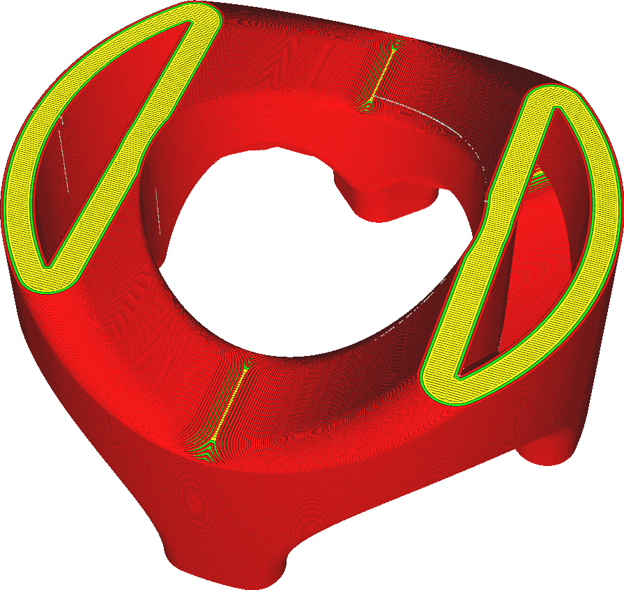

Mold
====
Instead of printing the model itself, this feature causes the printer to create a negative of the model, a mould, that you could cast a different material in to create your model. This mould has several specific properties that make it both workable to cast with and printable with FFF printing. This allows for the process of [Rapid Casting](https://en.wikipedia.org/wiki/Rapid_casting).

<!--screenshot {
"image_path": "mold_enabled_shell.png",
"model_path": "stature.scad",
"camera_position": [-78, 160, 228],
"layer": -1
}-->
<!--screenshot {
"image_path": "mold_enabled_mould.png",
"model_path": "stature.scad",
"camera_position": [-78, 160, 228],
"settings": {
    "mold_enabled": "True"
},
"colours": 32
}-->

Cura's mould generation will create a hollow with the exact shape that you want to cast. Around this hollow, a shell will be generated with a certain width, configurable through the [Minimal Mold Width](mold_width.md) setting. Above and below the mould, a skin will be generated with a certain height, configurable through the [Mold Roof Height](mold_roof_height.md) setting. However this skin will not be generated at the very top of the model so that you can pour the casting material in there. It will also not be generated at the very bottom of the model. You're meant to keep it on the build plate while it's being cast.

Designing Your Mould
----
Cura's mould generation is not perfect. A couple of things are missing. Here are some tips to fix them.
* Cura doesn't create sprues for all of the local maxima in your model. You need to add vertical rods to your model wherever you need a sprue.
* Cura doesn't allow for extra material to be cast in case your material shrinks while cooling down. You'd need to add additional sprues even to the highest point of your model if you are using a material that shrinks a lot.
* Cura's mould is always in one piece. For many shapes this means that the mould needs to be destroyed in order to remove it. Moulds can be destroyed in various ways; just by sheer force or by heating it up if the material inside allows for that, or by using a material like PVA that dissolves in water.
* Cura won't allow for putting in rods or wires to reinforce the mould. To enable that, put in extra bars in your model so that Cura will leave cavities for them, and insert the rod or wire afterwards.
* Undercuts in your mold are generated without warning. If your cast needs a lot of undercuts, you will need some sprues or other channels to get the material to properly flow in there and to get the air out. Also, be aware that your mould might need to be destroyed in order to get the cast out once it's solidified.

Materials to Print the Mould With
----
The ideal mould is:
* very stiff
* resistant to high temperatures
* chemically inert so that it doesn't bind to your casting material
* made out of a material that doesn't shrink

Additionally, some moulds need to be destroyed in order to get the model out. To this end, you could choose a brittle material or a material that can be dissolved using water or other chemicals, such as PVA.

Materials to Cast With
----
There are many different types of materials to cast a mould in. Some are more compatible with 3D-printed moulds than others. These are some examples of materials that may work:
* **Silicone**. Silicone does not bind to plastics, so it is easy to remove. Silicone is also very flexible and this makes it lenient to undercuts. What's more, silicones are thermoset and heat resistant, so you can also consider melting the mould off after it's been set. Some special tooling is needed to cast silicone though. In particular, you'll need a vacuum chamber to pump out the gas bubbles from the silicone.
* **Sand**. Sand is an industry standard for making a negative of something since it is very heat resistant but doesn't need to be heated in order to be cast. After casting it, you can bind it with concrete or glue in order to prevent it from falling apart. You can then use it to make another negative out of a more heat-resistant material.
* **Stucco**. Similar to sand, but generally made out of a finer grain. This has the advantage that the binding is already included in the material, so there is no need to bind it. It may result in a more brittle final result though.
* **Wax**. For making custom candles or figurines, you can cast a model in wax. Wax has a low melting temperature, so it won't melt the mould. It also doesn't bind to plastics, making it easier to release from the mould. Wax is very malleable and easy to modify after releasing it from the mould. If making a custom candle from this, don't forget to insert a wick before it's set.
* **Chocolate**, as a special customised treat or gift. To cast chocolate, melt it to just above its melting point, then pour it in the mould, vibrate it a bit to get the air bubbles out, and put it in the freezer immediately. You can even put the mould in a bath of cold water inside the freezer to subtract the heat faster. After five minutes, remove the chocolate carefully from the mould.

FFF printing can only work with thermoplastics. Thermoplastics are plastics that inherently become soft at high temperatures. This is not compatible with casting materials that are hot when casting. Some materials that are generally incompatible with 3D printed moulds:
* **Metals**, which need to be heated above the melting point of the plastics in order to be liquid enough to cast. The heat mass of the metal will cause your mold to melt.
* **Plastics that bind** to the plastic that the mould is made of. You couldn't separate the mould from the model after casting. You can spray some mould release in, but if the material is too similar it will still bind permanently to the mould.
* **Materials that shrink** too much after solidifying. Materials that shrink before solidifying are okay as long as you have sufficiently long sprues to allow new material to fill the cavity when that happens.
* **Epoxy resin** is not appropriate because while the resin is cold while it is being cast, the chemical reaction from the two components releases enough heat to melt the plastic. Epoxy also tends to stick very well to plastics.

If you need to create an object in a material that is not directly compatible with 3D printing, you need to work in multiple casting stages. Each stage creates a negative of the previous stage. For instance, you could print the shape of your object normally (with this setting disabled), then create a negative of that by putting the mould in a bath of stucco. Since the stucco is much more heat resistant, you can then use materials that need to be heated hotter to melt, such as bronze, or materials that bind to plastics such as epoxy.

The Casting Process
----
Casting with a 3D printed mould is largely the same as with any other mould and will depend greatly on the materials involved. There are a few points of special attention when it comes to 3D printed moulds though.

The thermoplastic you've printed your mould with has a low heat capacity and may have a reasonably low glass transition temperature. This means that time is of the essence after the mould has been cast. If the material cools down too slowly, the mould could get soft. This can cause the mould to deform and makes it harder to release the mould from the result. To accelerate the setting of the cast, you can for instance dip it in an ice bath.

3D printed moulds also have more ridges along their sides due to the boundaries between layers. These make it harder to release the mould from the cast. If you're using a release agent between the mould and the cast, use something that can fill up these gaps. Thin lubricants are not enough. More appropriate interface layers are wax or thicker lubricants.