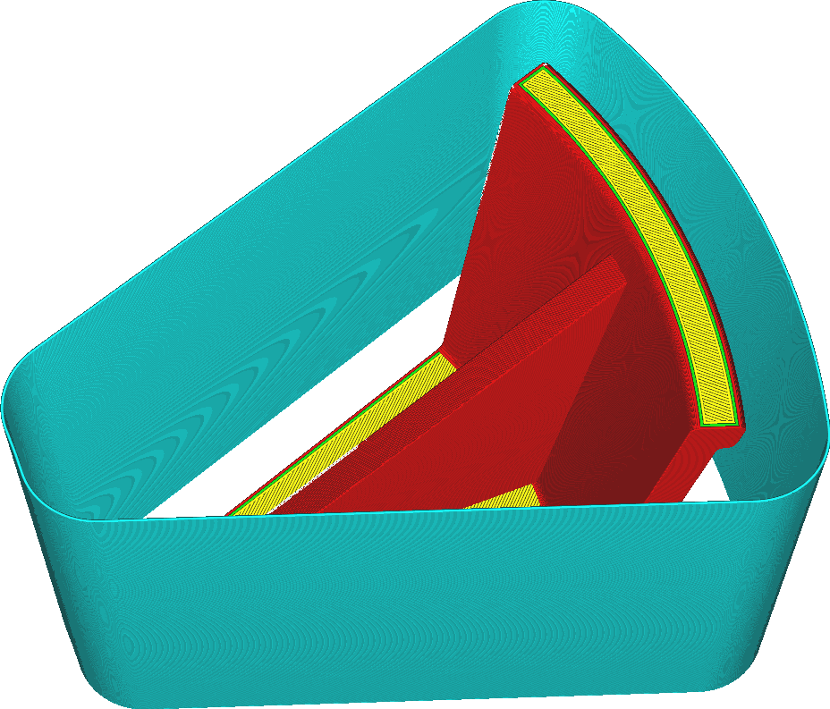

When this setting is enabled, the printer will construct a shell around your print that protects the print against air currents from the environment.

Some printers and printing materials are very sensitive to the environment they are printing in. Printing in different locations on the build plate might lead to different results because they are more susceptible to air currents from outside. If the print is left running overnight and the room becomes colder, this could impact a print significantly. The draft shield is meant to reduce that effect by creating a small, isolated volume around the print. This serves as a makeshift "heated chamber" to keep the print warm and protect it against cold air draughts from outside.

The shield is printed on the go as the model is printed. If multiple extruders are involved in the print, the draft shield will be printed using the extruder that starts the layer. This will alternate from layer to layer.

The draft shield has several major effects on the print:
* It will keep the temperature of the print more constant. This is the intended effect of the draft shield.
* Generally the temperature inside the draft shield will be higher than if there is no draft shield. This is because the heat has a harder time escaping and there can be no convective currents rising with the hot air from the print. This has an effect on all aspects of the print. In particular there will be more stringing and sagging.
* The fans on the print head will become less effective. The shield also disrupts the airflow there. To increase effectiveness of the fans on the print head, the [distance](draft_shield_dist.md) of the draft shield can be increased.
* The draft shield can double as an [Ooze Shield](ooze_shield_enabled.md). If travel moves are made towards an object that is protected by a draft shield, any ooze left on the nozzle will be wiped off on the shield.
* The draft shield can double as a [Prime Tower](prime_tower_enable.md). Since it's printed before the object, the printing of the draft shield is a way to get the material purged and properly flowing. This is only effective with 2 extruders though, since not all extruders will get purged if there are more than 2.