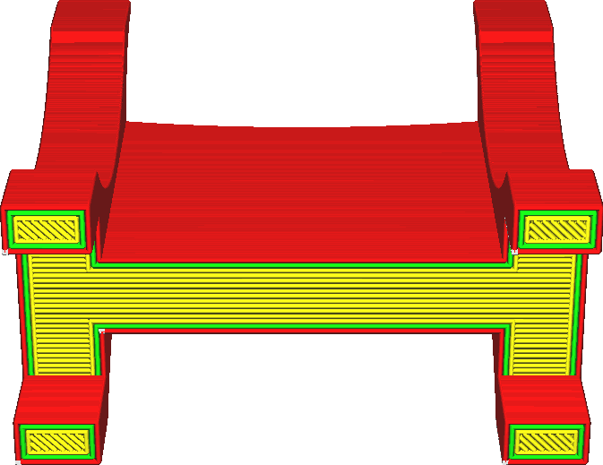
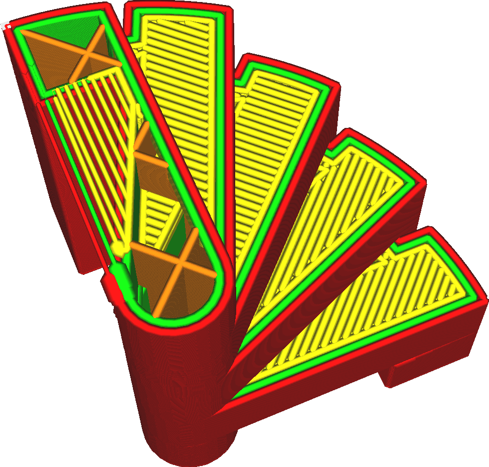

Enable Bridge Settings
====
When your model has some overhang that is supported on both sides, Cura will detect this and modify the skin area that is overhanging in order to print better. If this setting is enabled, you can tune the detection of these bridging areas and the resulting behaviour so that it bridge better.

<!--screenshot {
"image_path": "bridge_settings_enabled_default.png",
"models": [
    {
        "script": "rack_straight.scad",
        "scad_params": ["length=40"]
    }
],
"camera_position": [0, 74, -137],
"colours": 32
}-->
<!--screenshot {
"image_path": "bridge_settings_enabled_enabled.png",
"models": [
    {
        "script": "stairwell.scad",
        "scad_params": ["steps=4", "width=10", "height=20"]
    }
],
"layer": 275,
"settings": {
    "bridge_settings_enabled": true
},
"camera_position": [-12, 28, 63],
"colours": 64
}-->

Normally Cura will use a fairly rudimentary bridging technique. Cura will detect overhanging areas of skin that are supported on multiple sides. The [direction of those skin lines](../shell/skin_angles.md) is adjusted to bridge those areas automatically. This ensures that the greatest possible part of the overhanging area is supported on multiple sides and improves print quality.

When this setting is enabled though, you can tune that behaviour more precisely according to your requirements. This allows you to tweak:
* printing speed
* flow rate
* density (like infill density, but with the skin lines)
* fan speed
* for the walls, also coasting

These settings can be adjusted separately for the skin that bridges a gap as well as for the walls. If [Bridge Has Multiple Layers](bridge_enable_more_layers.md) is enabled, they can also be adjusted separately for the second and third layer above the bridged gap. It also allows tweaking which parts of the print are seen as bridging areas, by tuning [what fraction of an area must be over air](bridge_skin_support_threshold.md) and a [minimal width for the walls](bridge_wall_min_length.md).

By enabling the bridging settings you get greater control over how bridges are handled in your print. By tuning the bridging parameters very well, you can improve the quality of your overhangs significantly and improve accuracy in the vertical direction. The only downside is that if you don't adjust the bridge settings to your printer, the print could be made worse just as likely.