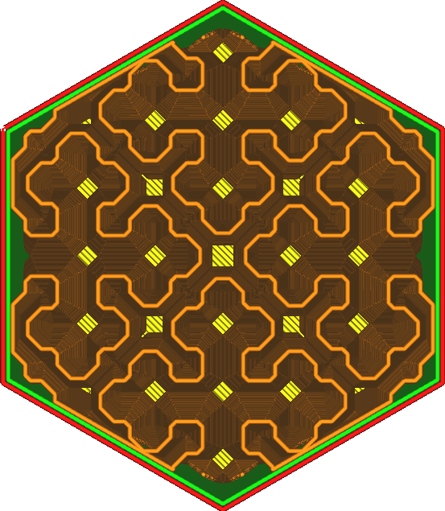
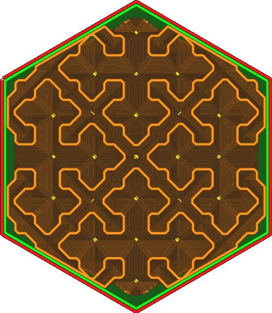

The Cross 3D [infill pattern](infill_pattern.md) was made to facilitate flexible prints. The pattern contains 4-way crossings though that are very rigid. This setting causes the pattern to avoid the crossing in order to avoid being too rigid in certain places. It will make the pattern leave a pocket of air in the crossing. This setting determines the size of the pocket.

The pattern varies the distance around the 4-way crossing. This setting determines the size of the pocket in the layers when the lines are touching completely. The maximum size of the pocket is determined by the infill density. The pocket size will not be drawn larger than the square root of 2 times the infill line distance. If a value is entered that is bigger it'll have no effect, but bigger values can still be entered to facilitate bigger pocket sizes in case [gradual infill](gradual_infill_steps.md) or [variable infill density](cross_infill_density_image.md) is used.

Increasing the value for this setting makes the infill weaker in the vertical direction and spreads around the strength better to create a more even strength distribution.