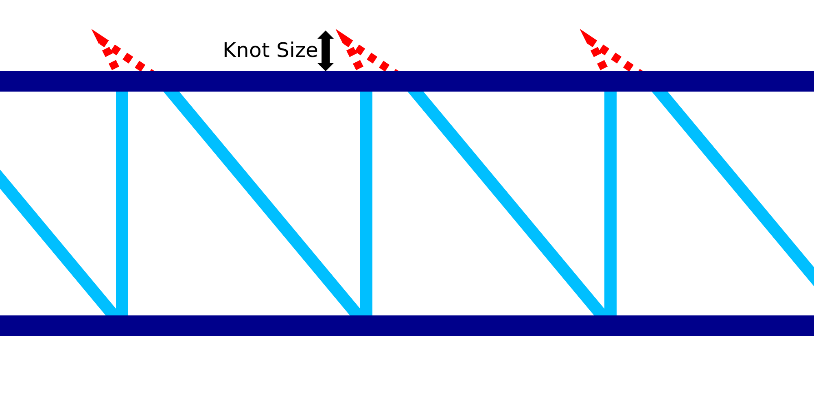

If the [Wire Printing Strategy](wireframe_strategy.md) is set to "Knot", a little upwards and backwards motion will be made at the top of each saw tooth. This setting configures the magnitude of that motion.

The motion for this "knot" is a series of travel moves:
1. First, the nozzle will move upwards by the distance indicated by this setting. At the same time, the nozzle will move backwards by half of this distance.
2. If there is any [delay](wireframe_top_delay.md) in the top, the nozzle will pause for the set amount of delay. This pause is done in the tip of the knot's motion.
3. Third, the nozzle will move back down to the ordinary height. At the same time, the nozzle will move forward by 1.5 times the Knot Size, ending up at the distance indicated in this setting away from the vertical line.

The purpose of the knot is to give the horizontal ring on top of it some area to attach to the saw-tooth pattern. The knot will vary a little bit from side to side, so if the horizontal ring is not placed down very accurately there is still a bigger chance that they attach to each other. Also, the knot will make the upward line extend slightly further upwards, causing the horizontal ring to be pushed on top of it. And lastly, the knot will also produce some oozing due to the lack of retraction in this travel move. This produces a blob on which the horizontal ring can rest better.