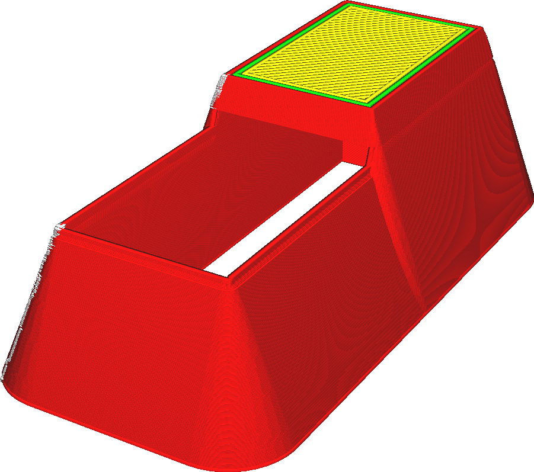
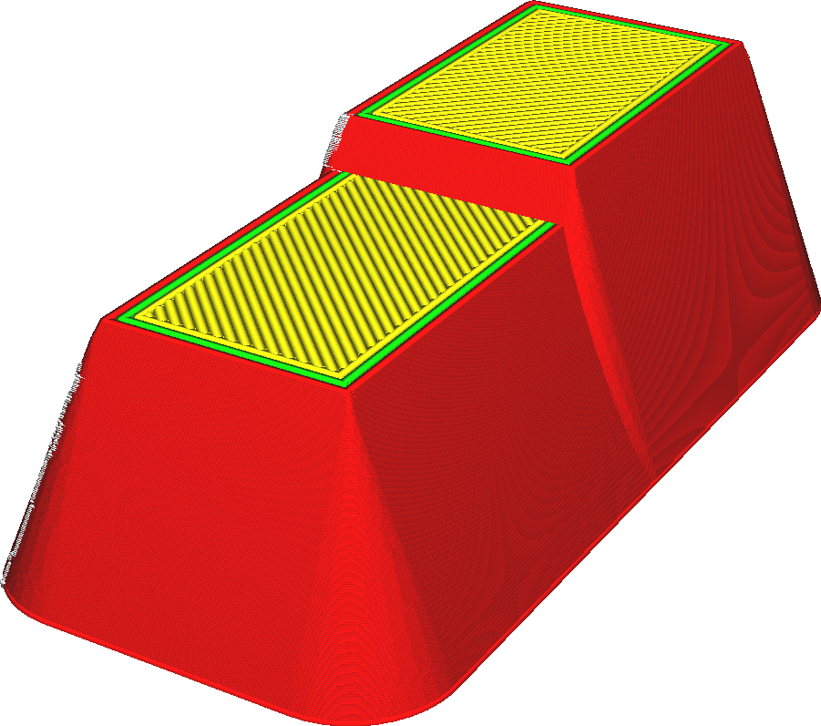

Some models, particularly those made for manufacturing techniques like injection moulding, tend to come with internal cavities that are not visible. If this setting is enabled, Cura removes those internal cavities.

The cavities on the inside might be designed to save on material, but with 3D printing there are some constraints that cause those models to print worse. For instance, 3D printers don't do well with thin walls that aren't a multiple of the line width, and the top skin tends to sag if it is not supported by infill. It is generally better to make a solid mesh and let the slicer decide how to fill it. This mesh fix setting lets you do that without needing to edit the mesh.

Cura will only look horizontally whether a cavity is enclosed completely. It will not look whether a cavity is accessible from the top or bottom. The difference might still be visible from the top or bottom.