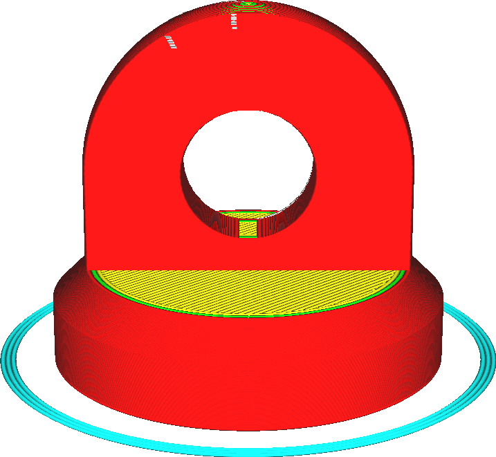
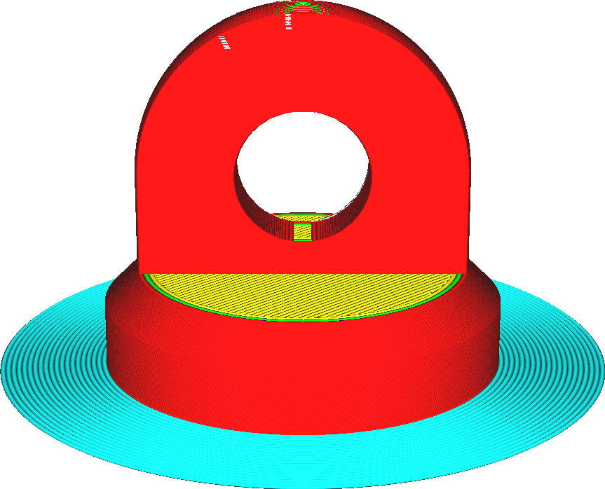
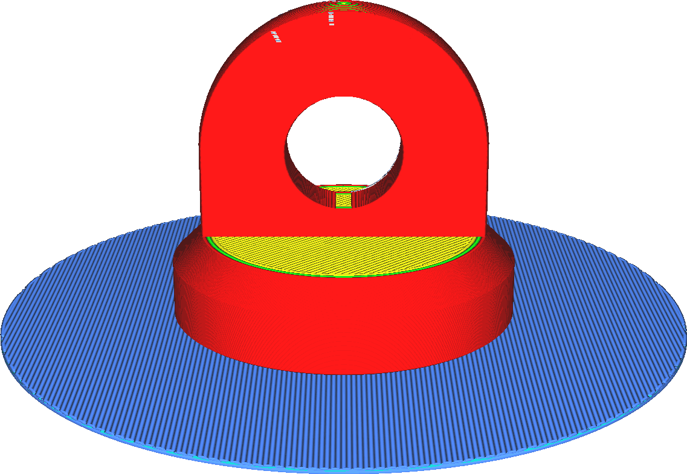

There are three types of build plate adhesion: skirt, brim and raft. You can also easily disable the adhesion types by setting it to None.

Skirt
----
A skirt is a single line encircling your print. It will not directly contribute anything to build plate adhesion. However if you don't want to use the other adhesion methods, this method still serves two functions.
* It causes your nozzle to prime before starting the printing of your actual model, to make sure that material is properly flowing.
* It allows you to see whether or not your build plate is properly levelled.

Brim
----
A brim is a single layer flat area around the base of your model. Its purpose is to keep the edges of your print down and make the contact area between your print and the build plate bigger.
* The bigger surface area allows your print to stick better to the build plate. This is useful for pretty much any print larger than a few centimetres.
* This brim will also keep the edges of your print down. Materials that shrink a lot when cooling down (like ABS) tend to warp a lot while printing. Having a brim with sufficient width can keep the corners in place, preventing this warping.

Raft
----
A raft is a thick plate between the model and the build plate. This raft shields your print from the heat of the build plate. It will also have a lot of surface area to stick to the build plate with. The print gets put on top of this raft, where it may stick much better. Be careful with thin prints though, since it may be hard to remove the raft without damaging the print.