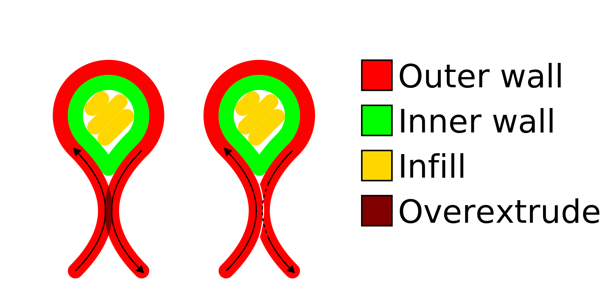
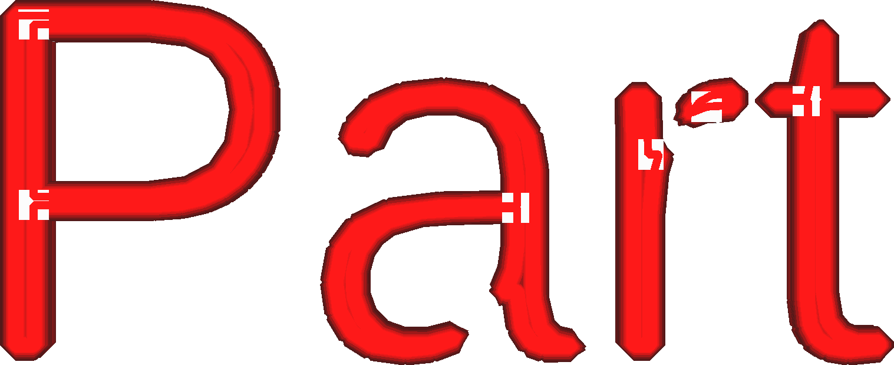

When printing very thin parts, opposite outer walls may come close enough together that they overlap. When printing both walls with their normal line width they would overextrude. This setting prevents that overextrusion by reducing the width of one of the lines, preventing this overextrusion and achieving a better dimensional accuracy.

The line width of the outer wall that overlaps another outer wall is reduced by the overlapping area. This compensates for the overextrusion.

As described above, this feature tends to improve dimensional accuracy. However, the disadvantage is that the flow rate becomes less even, which causes underextrusion in some places and overextrusion in others. Also, the flow rate can be reduced below the minimum flow rate of the nozzle and extruder set-up, leading to inconsistent flow and beading. To reduce this effect, you can set the [Minimum Wall Flow](wall_min_flow.md) which will turn some of the thinnest walls into travel moves at the cost of dimensional accuracy.

**This setting tends to look messier in layer view. In the actual print, there are no borders between lines. The layer view shows only the paths of the g-code, but in actuality the material gets pushed aside by the other wall that it overlaps with. Also, tiny reductions in flow will not manifest itself in the actual print since the flow rate through the nozzle can't adjust that fast. These effects make the actual print come out smoother than layer view predicts.**