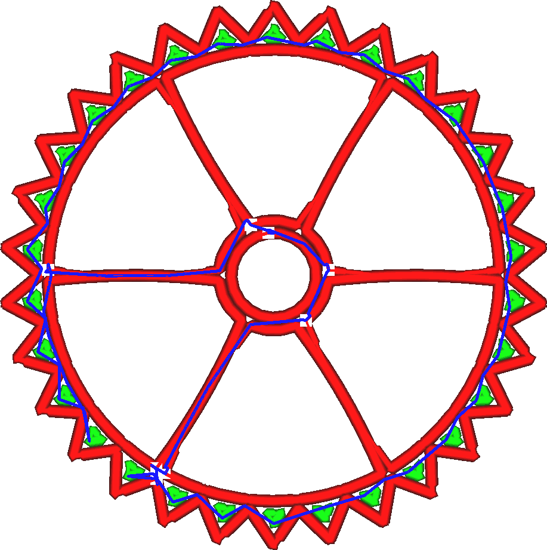
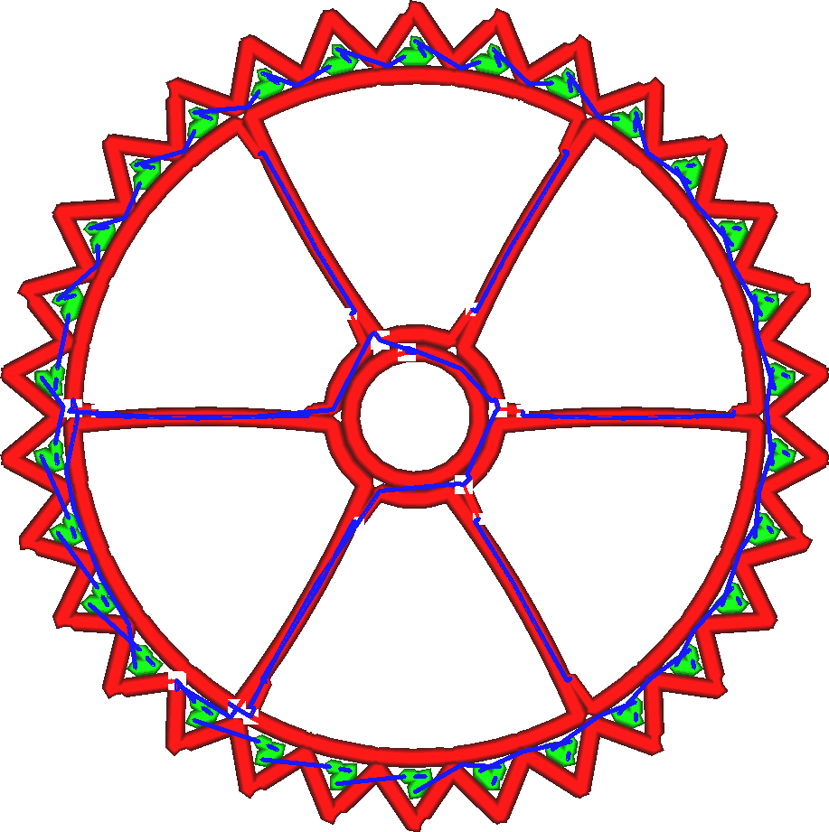

Compensating for overlaps in wall lines will reduce the flow rate of some of the walls. This can be problematic, because it can reduce the flow rate arbitrarily low, down to 1% if the walls almost completely overlap. Printing at extremely low flow rates doesn't work well. It tends to form a droplet pattern instead of continuously extruding lines.

This setting will turn those lines with extremely low flow rate into travel moves, effectively snapping their flow rate to 0%. Material will still ooze out as with normal travel moves, but will not form beads.

The nozzle will still follow the path of the wall in order to ooze in the correct location.

Increasing this setting will cause your walls to be thinner than desired. Instead of drawing very thin lines you're no longer drawing anything any more. Technically this is underextrusion, causing your part to be thinner than desired. However the wall wouldn't have printed well anyway. Instead of drawing a long line of blips or beads across the wall, nothing will be printed, making the wall a bit smoother.

Set this setting to the minimum wall flow rate that your nozzle can achieve without forming droplets. Typically this is about 60%. If the line width would be reduced below 60% those droplets would form, so it is better to turn those lines into travel moves. If you are printing at greater layer heights or using thicker wall lines, you may be able to reduce this setting a bit to get greater dimensional accuracy.