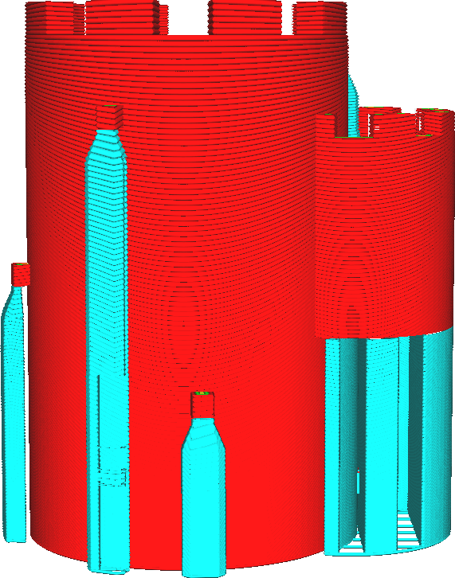
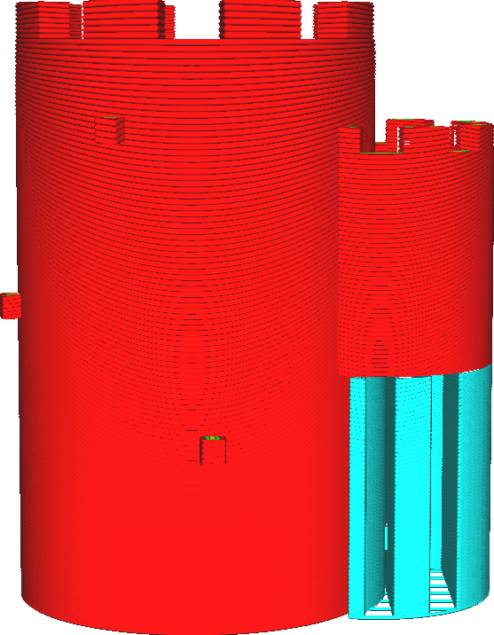
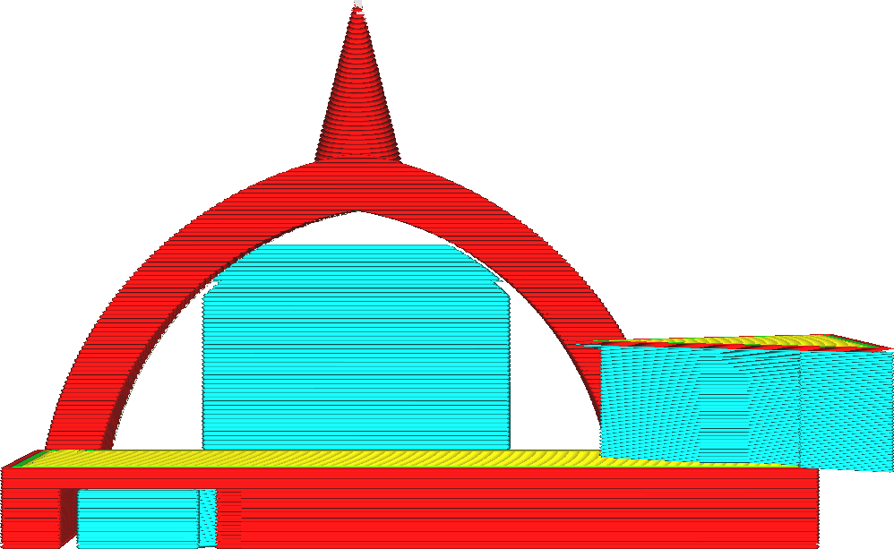

Minimum Support Area
====
This setting imposes a minimum allowed size for pieces of support. If a piece of support has less area than the value of this setting on a certain layer, the support is left out there.

This setting exists because thin pillars of support are likely to topple over. They also tend to be supporting small features that would probably print fine without support. If the support topples, lots of blobs will be left on the print. So it may be better to leave these thin pillars out. This setting provides a way to filter support away by the cross sectional area of the pillar.

Increasing the area will reduce the amount of support printed, reducing time and material usage slightly. More importantly, it improves reliability of the print since there is less chance of support pillars toppling over. However it will also remove support for small features in your print, so the overhang quality can worsen for those pieces.

For some shapes this can have the nasty side effect of removing the top part of support if the top part falls beneath the threshold area but the bottom part doesn't. This can leave parts unsupported that you'd normally expect to be supported.

 