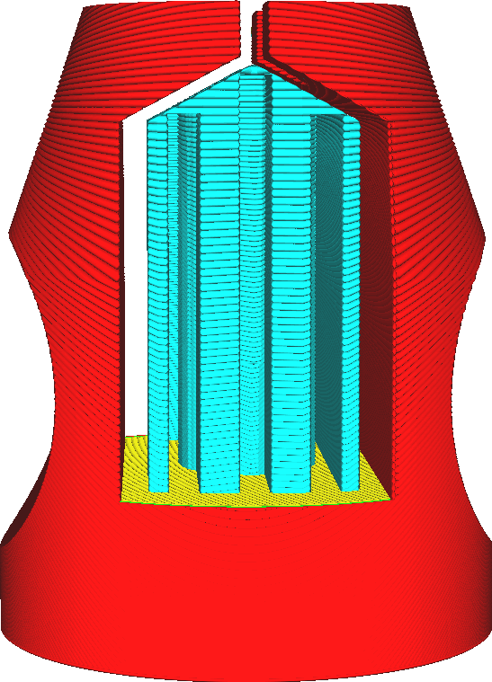
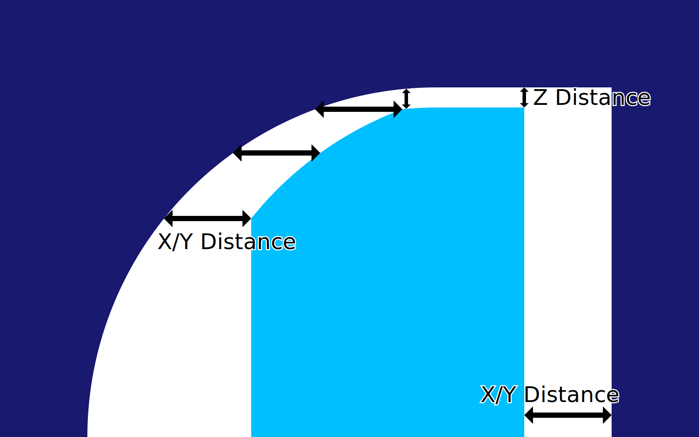

This indicates how much distance must be kept horizontally between the support and the model.

The horizontal distance is meant to prevent the support from hitting the model, where it would leave a scar on the surface. However, this also creates a larger distance between the model and the support structure where the overhang is, leaving smaller overhangs unsupported.

X/Y versus Z distance
----
Both the X/Y distance and the Z distance should be observed exactly; not more, not less. This is overconstrained, so there must be a preference between the two. This is indicated by the [Support Distance Priority](support_xy_overrides_z.md) setting. That setting changes the behaviour of this Support X/Y Distance setting.

If X/Y overrides Z, the X/Y distance is held, even if that means that the Z distance is too great. The Z distance is still held as minimum.

If Z overrides X/Y, the Z distance is held, even if that means that the X/Y distance is too small. The X/Y distance then only has any influence away from the top of the support where the Z distance has no influence.