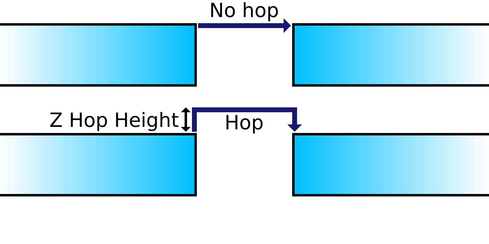

If this setting is enabled, the nozzle will be lifted above the print slightly when the nozzle needs to travel from one place to another. The aim of this is that the nozzle goes over the print instead of hitting the previously printed parts with the nozzle.

Whenever a retraction is done, the nozzle is raised (or the build plate lowered) to create clearance between the nozzle and the print. This has several advantages:
* It prevents the nozzle from hitting the print during travel moves. When the nozzle hits the print it leaves a visible scar, so it should improve the visual quality of the walls of the print.
* If the material oozes out of the nozzle during travel moves, the ooze gets deposited where the nozzle lands after the travel move, which is often in the infill where it's not visible. This reduces blobs on the surface.
* Blobs on the surface have a chance to knock over your print, so enabling this setting can improve reliability.

However, moving the nozzle up and down all the time takes a bit more time, so your print will take longer to complete. It can also wear down the Z axis of the printer faster, depending on the printer's design.