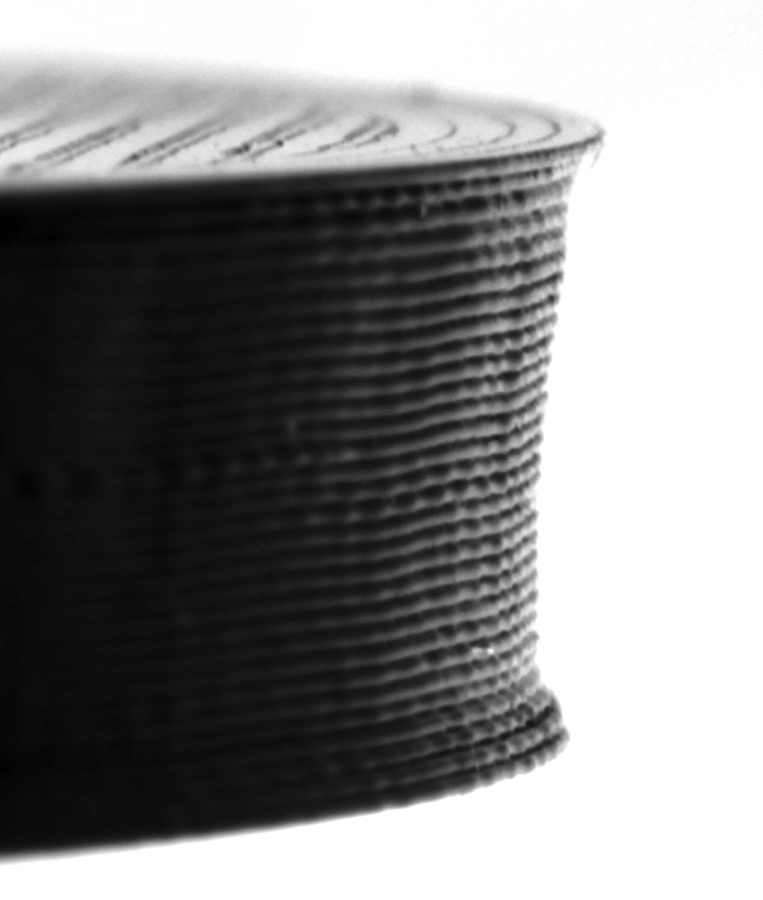

Sometimes the bottom side of the print is slightly wider than the rest of the print, resulting in a small lip there. This is called an "elephant's foot", since it resembles the legs of an elephant where the toes are slightly wider than the rest of the leg.

There are several effects that people call elephant's foot with completely different inherent causes. These will require completely different solutions, too. This article will help you find the root cause.

Brim
----
Sometimes the elephant's foot is really just a part of the brim that wasn't removed properly. If you've torn off the brim by hand, you can tell because the brim line is completely adjacent to the normal wall line, and the normal wall line is directly underneath the rest of the wall. To remove the brim completely, it's best to use a sharp knife to carve along the bottom side of your print.

If the model doesn't have a big bottom side, consider setting the [adhesion method](../platform_adhesion/adhesion_type.md) to a skirt instead. If this gives too much problems with bed adhesion, you can try alternative methods of improving adhesion, such as setting the [Initial Layer Bottom Pattern](../shell/top_bottom_pattern_0.md) to "concentric".

Warping
----
Perhaps the most common cause of an actual elephant's foot is warping. As the material cools down, it will shrink a bit. The material in the bottom layer(s) is sometimes not able to shrink. They remain their original size, but the layers above it shrink a bit. There are several reasons why the bottom layers may be unable to shrink:
* It's stuck to the build plate, which doesn't shrink.
* It's heated by the build plate, which prevents it from shrinking.
* There is skin adjacent to it, which blocks the shrinkage. (On higher layers there may be infill instead).

To prevent warping, take a look at the [troubleshooting article](warping.md) about it. Specifically for this type of warping, here are a few things you can try:
* Increase the [wall thickness](../shell/wall_thickness.md) to prevent the walls next to the infill from shrinking.
* Reduce the [build plate temperature](../material/material_bed_temperature.md) to allow the first layer to shrink just as much as the other layers. If the bed temperature was very high, it can also allow the material to sag a bit, which makes it wider at the bottom. This effect is usually small, but this will also be prevented by reducing the bed temperature.
* Increase the [bottom thickness](../shell/bottom_thickness.md) to more gradually transition to a shrunken size. You can even consider printing the model completely solidly (preferably by setting the bottom thickness extremely high) to get rid of the difference in shrinkage completely.

Build plate adjustments
----
The elephant's foot can also be caused by having the build plate too close to the nozzle while the first layer is printed. This effectively overextrudes, which causes the first layer to be pushed outwards.

To adjust the build plate, consult the manual of your 3D printer. Most printers have adjustment screws in the bed or the gantry to adjust the height difference of the build plate during the first layer. Adjust the build plate during printing (during the brim, skirt or raft preferably) until the first layer is nice and smooth and not thinner than any other layer.

You can also directly adjust the [flow in the first layer](../material/material_flow_layer_0.md) in Cura to compensate for any overextrusion. Alternatively, reducing the [Initial Layer Line Width](../resolution/initial_layer_line_width_factor.md) may also normalise the extrusion enough so that the elephant's foot is prevented.

General solutions
----
Here are a few solutions you can try that get rid of any type of elephant's foot, regardless of its cause:
* Using a [raft](../platform_adhesion/adhesion_type.md) moves the entire print off the build plate, preventing any effects caused by the build plate such as its temperature and sticking too much to the build plate, and also prevents the need for a brim.
* Reduce the [Initial Layer Horizontal Expansion](../shell/xy_offset_layer_0.md) (possibly to something negative). This compensates for the elephant's foot in the first layer.