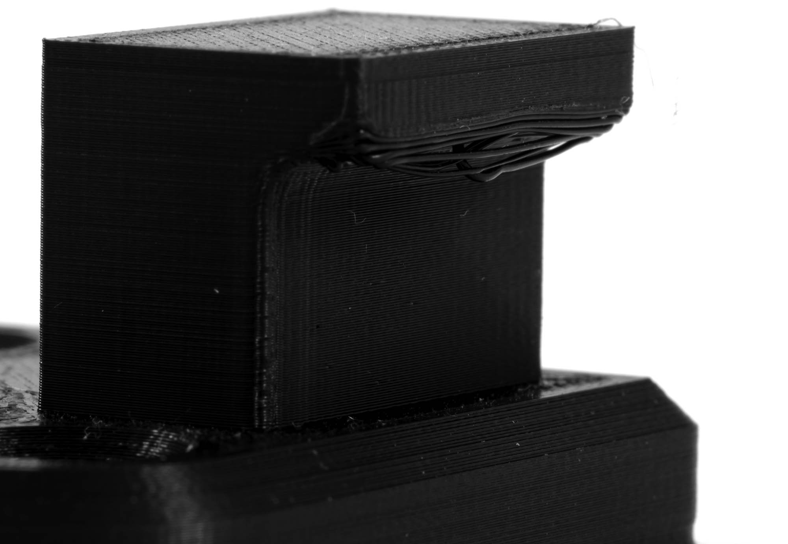
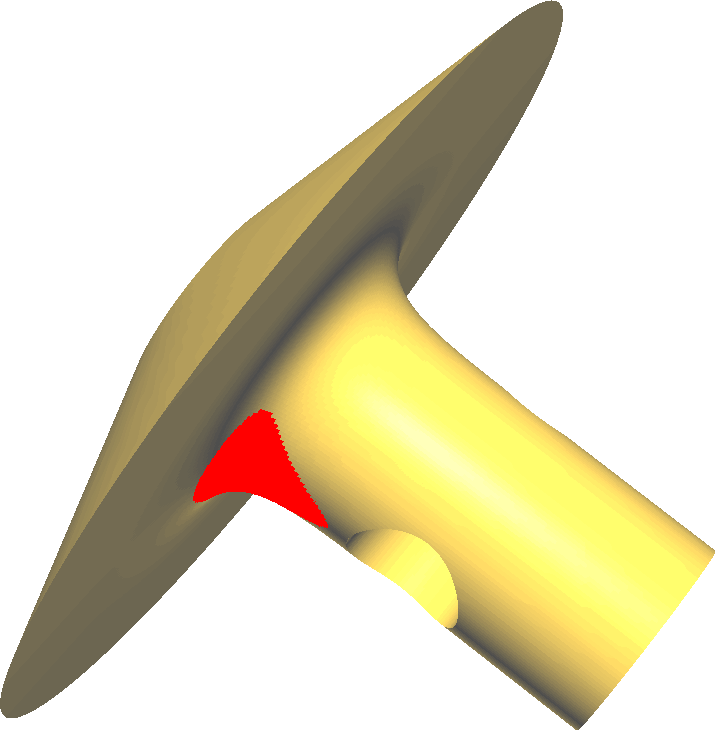

Fused Filament Fabrication works through laying down a line of molten plastic. This line is soft, and if it doesn't rest on anything it will droop down. This is called sagging.

Sagging tends to make overhanging parts look stringy. Rather than smoothly following the intended surface of the model, it will be too low. In extreme cases, the bottom side of a surface becomes so ragged that the hollow inside of the print can be seen.

Causes
----
Sagging is actually not, or hardly, caused by gravity. It is mostly caused by the force of the material being pushed out the nozzle. As such, even printers that are turned upside down or printing in microgravity will experience this phenomenon. The pressure by which the material is extruded pushes the material down because the nozzle is (normally) oriented downwards.

Normally the pressure inside the nozzle chamber is necessary to push the (viscous) material outside and flatten it in the shape of a wide and flat line of material, by squishing it between the nozzle and the previous layer or the build plate. However if there was no material in the previous layer there will be no counter-pressure to flatten the bead. Instead it will be pushed too far down.

Bridging
----
One technique to improve the quality of overhangs is to optimise the way in which the overhanging gap is bridged. This involves reducing the pressure with which the material is pushed out the nozzle, as well as attempts to increase the viscosity of the material or to make it solidify faster. Additionally the printed lines can be reoriented to reduce the distance along which the lines are unsupported. These techniques together are called bridging.

Cura provides a number of ways with which to improve bridging. It will provide even more if [bridge settings](../experimental/bridge_settings_enabled.md) are enabled. Enabling this will cause more settings to appear and also adjusts the print parameters for bridging areas by default.

When configuring bridging to reduce sagging, consider the following adjustments:
* Reducing the [printing temperature](../material/material_print_temperature.md) makes the thermoplastic more viscose, causing it to sag less.
* Reducing the [layer height](../resolution/layer_height.md) or the [line width](../resolution/line_width.md) reduces the pressure with which the material is pushed out the nozzle. This by itself reduces sagging, but these lines also have a smaller heat capacity, making the fans on the print head more effective at cooling.
* Reducing the [print speed](../speed/speed_print.md) reduces the pressure with which the material is pushed out the nozzle too. In this case the thermal capacity does not get reduced, but the fans will be blowing on the material longer, which also increases their effectiveness and reduces sagging. If the bridge settings are enabled, the printing speed of bridges can be adjusted separately. Reducing the [printing speed of bridging walls](../experimental/bridge_wall_speed.md) is effective at improving sloping overhangs. Reducing the [printing speed of bridging skin](../experimental/bridge_skin_speed.md) is effective at reducing sagging in completely horizontal overhang areas. There is also a variant of this that adjusts the [speed for overhanging walls](../experimental/wall_overhang_speed_factor.md). This setting will kick in even if the surface is not completely horizontal, allowing specific overhang printing speed for sloping walls only.
* Reducing the [flow rate](../material/material_flow.md) is similar to reducing the line width. This will reduce the pressure with which the material is pushed out as well as the thermal capacity, allowing the material to solidify faster. This setting can be adjusted as well for just the bridging areas, separately for the [walls](../experimental/bridge_wall_material_flow.md) or the [skin](../experimental/bridge_skin_material_flow.md). Reducing the flow for large areas tends to produce gaps in the surface and a ragged look as well though, so visually the overhang might still look bad if this is adjusted. However the dimensional accuracy should be improved.
* Increase the [fan speed](../cooling/cool_fan_speed.md) to cool the material faster. This solidifies the material faster, preventing it from drooping down.
* Print the walls from [inside to out](../shell/outer_inset_first.md). This will allow the outer wall to lean on top of the adjacent inner wall, which prevents it from falling down. This is most effective with a small [line width](../resolution/wall_line_width_0.md).

Support
----

Another very common technique to improve overhanging parts is to support them with a support structure during printing. This support structure is later removed after the material has solidified. Printing support is very effective at preventing sagging regardless of the size of the overhang area, but it takes extra time and material and leaves a scar where the support was attached.

Cura has two techniques to generate support. There is a default "area support" method, which is generated if [support is enabled](../support/support_enable.md). Alternatively, a tree support method is generated if [tree support is enabled](../experimental/support_tree_enable.md). The default technique is generally more effective to reduce sagging, but will sometimes give a more uneven bottom side as well. Tree support tends to let the strings sag a bit further but also more evenly.

Where support is generated depends largely on the [overhang angle](../support/support_angle.md) specified. Reducing the overhang angle will cause more support to be printed, which reduces sagging in more parts of the print but will also take more time and material and cause more scarring. Where the support is generated can also be fine tuned by adding support blockers to the print or meshes that get printed as support.

Even if the overhang is supported by support, it may still sag a little bit. To allow the support to be removed, a certain [vertical distance](../support/support_z_distance.md) is kept between the model and the support. The model will sag up to this distance before support is effective, so reducing the Z distance will reduce sagging (but make the support harder to remove). Some materials are designed to be removed easier, by not chemically bonding to the build material or by dissolving. Those materials can afford to reduce the Z distance, further reducing sagging, while still making it possible to remove the support afterwards. The print may also sag in between the support lines, so reducing the [distance between the support lines](../support/support_line_distance.md) will reduce sagging as well (but increase printing time and again make it harder to remove support).

Adjusting the model
----
If you have the freedom to adjust the model that gets printed, that may result in a much cleaner result than trying to bridge the overhangs or support them. Instead of letting the material sag in the overhangs, design and orient your model such that there are no overhangs.

The most basic trick to apply this is to rotate the model. If your printer is capable of printing 45 degree angles without sagging, you can rotate a model with a vertical and a horizontal piece such that they are two 45 degree slopes, slightly reducing quality of the vertical wall, but preventing sagging in the horizontal part. Be careful though to not make the contact area with the build plate too small, or the print might detach from the build plate and be ruined still.

Adding chamfers can also help to reduce the amount of overhangs in the model with relatively little added material. Cura provides an automated method to add chamfers to your model as well, through the [Make Overhang Printable](../experimental/conical_overhang_enabled.md) setting. Adding chamfers essentially adds the support structure to the actual model. They will then be printed seamlessly into the model, which looks nicer. It also saves on material, compared to printing support, since the supporting material brings the forces quickly towards the rest of the model. And in the end, your object will be stronger.

In general, when designing objects for 3D printing, it's best to avoid overhangs at all. If the geometry of the object doesn't allow you to, consider breaking up the model into multiple parts and assembling them afterwards.