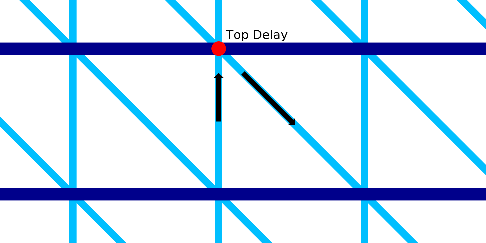

With this setting, the nozzle will stand still for a moment after printing an upward line.

While the nozzle stands still at the top of the upward line, the upward line gets some time to solidify. This prevents it from being dragged along with the nozzle once it starts moving downwards again.

Of course, adding delay adds significantly on the printing time. While standing still, the heat from the nozzle can also melt the material and it will be oozing there at the top. This adds a blob of molten material on top of a single line of filament, which makes that line a bit top heavy.

This setting adds a conglomerate of factors to the print that are hard to predict. Which precise delay works best for your material, printer and model needs to be determined experimentally. In general, increasing the delay within reason tends to have a positive impact on the reliability of the print but a big negative impact on printing speed.