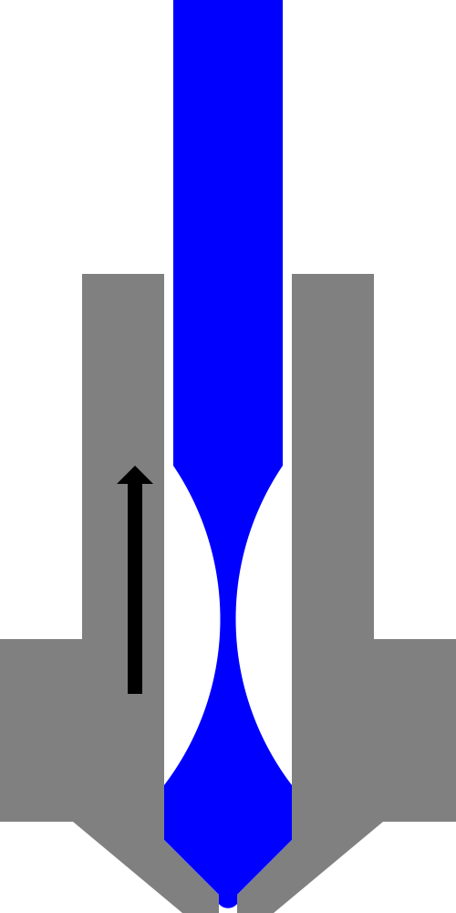

Teplota pro zlomení
====
U některých tiskáren, je-li materiál zatažen do spínače vláken, musí být materiál čistě odřezán tak, aby prošel podavačem bez zamotání. Toto nastavení konfiguruje část postupu tak, aby bylo čistě odlomeno.

Toto nastavení upraví teplotu na vychladnutí před odlomením vlákna. Toto chlazení proběhne mezi druhou a třetí fází (jak je znázorněno na obrázcích níže). Cílem je umožnit ztuhnutí vlákna a umožnit tiskárně ho zlomit čistěji, než aby ho vytáhla do dlouhého pramene, který by se mohl v podavači zachytit.

**Tento parametr není v rozhraní Cura v současné době viditelný. Může být definován pouze profily. Cura ho během slicování také nepoužívá. Tiskárny, které rozumí formátu souboru materiálu Cura, jej však mohou použít ke správné konfiguraci svého postupu změny vlákna.** Díky skriptu pro následné zpracování lze do tisku vložit příkaz `M600`, který vyvolá změnu vlákna.
