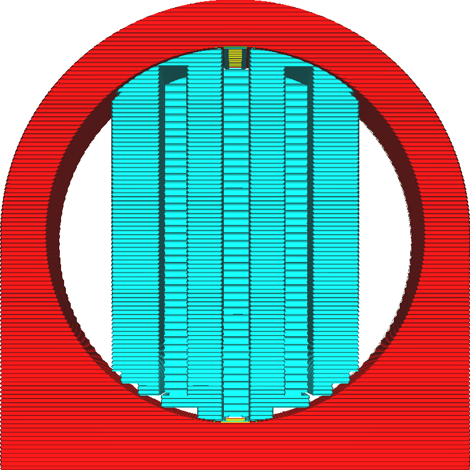

Výška kroku schodů podpěry
====
Pokud je položka [Umístění podpěry](support_type.md) nastavena na "Kdekoliv", může být podpěra umístěna na modelu. Nebude však přesně sledovat obrysy modelu. Místo toho má podlaha podpěry stupňovitý vzor. Tímto způsobem podpěra naváže spojení s modelem pouze na několika místech.

Toto nastavení určuje výšku těchto schodů.

Výška schodů se počítá podle vzdálenosti od povrchu modelu. To znamená, že pokud jste definovali svislou vzdálenost v parametru [Vzdálenost podpěry dole](support_bottom_distance.md), ta je odečtena od výšky a spojení mezi modelem a podpěrou bude větší. Podobně také parametr [Povolit podlahu podpěry](support_bottom_enable.md) umožňuje snížit účinek schodovitých stupňů.

Parametr [Maximální šířka kroku schodu podpěry](support_bottom_stair_step_width.md) omezuje šířku kroků. Pokud je povrch modelu tak mělký, že malá výška kroku by měla za následek velkou šířku kroku, bude podpěra po zbytek výšky kroku sledovat povrch modelu.

Zmenšením tohoto parametru bude podlahu podpěry plynulejší. To zvyšuje adhezi mezi podpěrou a modelem, což ztěžuje odstranění podpěry, ale také je podpěra stabilnější.
