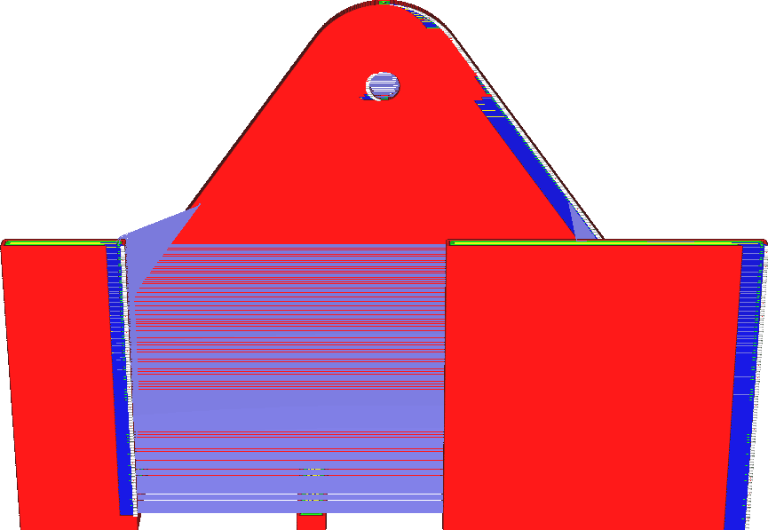

Volume en roue libre
====
Ce paramètre détermine à quelle distance avant la fin du contour le chargeur cessera d'alimenter le matériau. La longueur de la côte est cependant configurée en volume de matériau. Elle est plus étroitement liée au volume à l'intérieur de la chambre de la buse.

L'augmentation du volume en roue libre fait que la buse s'arrête d'extruder plus loin avant d'avoir fini le contour. Le résultat est qu'il y aura plus de sous-extrusion vers la fin. La fonction de la coulée en roue libre est de compenser la tache lorsque le contour est cousu, de sorte que l'augmentation du volume de coulée peut compenser des taches plus grandes.

Cependant, une augmentation trop importante du volume côtier provoquera une forte sous-extrusion vers la fin du contour. Cela peut même entraîner une certaine sous-extrusion dans ce qui est imprimé après le contour, puisque la pression sur la buse est encore faible then.
