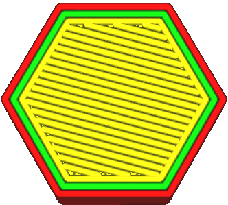

Alterner la rotation dans les couches extérieures
====
Lorsque le haut et le bas sont imprimés avec des lignes ou des motifs en [zigzag](../shell/top_bottom_pattern.md), les lignes sont normalement orientées dans les directions diagonales, en alternant les deux directions chaque fois que cela est possible. Si ce paramètre est activé, il alternera plutôt dans quatre directions : deux directions diagonales, verticale et horizontale.

Ce paramètre remplacera le paramètre [Sens de la ligne du dessus / dessous](../shell/skin_angles.md). Le comportement est cependant le même. En fait, ce paramètre peut être complètement émulé en entrant les angles `[45, 135, 0, 90]`.

En général, votre impression sera la plus rigide dans le sens de la longueur des lignes. Si ce paramètre n'est pas activé, il le sera dans les deux directions diagonales, ce qui le rendra plus faible dans les directions orthographiques. Ces directions diagonales sont choisies parce que les mécanismes de portique les plus courants pour les imprimantes 3D utilisent plus de moteurs pour le mouvement diagonal, ce qui leur permet d'accélérer plus rapidement dans ces directions.

Si ce paramètre est activé, les directions des lignes sont réparties plus uniformément. La force de l'objet est ainsi répartie plus uniformément. Cela rend l'objet plus fort dans les directions verticale et horizontale, mais légèrement plus faible dans les directions diagonales. Il faut également un peu plus de temps pour imprimer l'objet.
