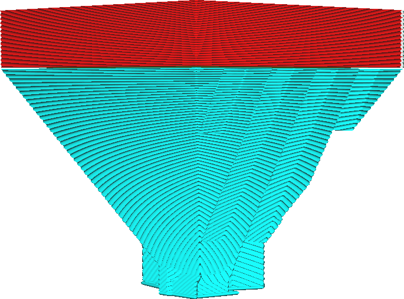

Activer les supports coniques
====
Si ce paramètre est activé, la structure de soutien ne sera plus complètement verticale sur les côtés. Le support aura une forme conique, devenant plus petit ou plus grand vers le bas.

Le support lui-même sera incliné d'un certain [angle](support_conical_angle.md). En cas d'angle négatif, le support s'élargit vers le bas, ce qui le rend beaucoup plus stable. Avec des angles positifs, il se rétrécira vers le bas. Cela permet d'économiser beaucoup de matériel et de temps d'impression. Pour éviter que le support ne devienne instable, une [largeur minimale](support_conical_min_width.md) peut également être définie pour le support.

Le support conique est le paramètre le plus puissant pour la pondération entre le temps d'impression et la stabilité du support. Il existe deux principaux cas d'utilisation du support conique :
* Pour économiser du matériel et du temps d'impression. Le support conique peut facilement vous faire économiser la moitié du matériel nécessaire au support, et par extension la moitié du temps passé à l'imprimerie. Cette solution est particulièrement efficace en cas de grands volumes de support, pour des impressions de grande taille.
* Pour rendre le support plus stable en utilisant un angle négatif. Si votre tirage comporte de petites caractéristiques en hauteur qui nécessitent un support, il produira normalement de très hautes [tours](../support/support_use_towers.md) qui ont tendance à tomber pendant le tirage. Avec un support conique, ces hautes et minces structures de soutien peuvent être élargies dans le bas. Cela leur donne une certaine stabilité supplémentaire. Cependant, l'impression de ce support prendra plus de temps car il nécessite plus de matériel.

Lorsque le [Placement du support](../support/support_type.md) est réglé pour placer le support uniquement sur la plaque de construction, le support conique permet de s'étendre autour du modèle pour continuer à soutenir le modèle dans les endroits qui se trouvent au-dessus des autres parties du modèle. Le support ne reposera toujours que sur la plaque de construction, mais en raison de sa forme, il peut maintenant atteindre les zones en surplomb dans les coins qui ne seraient pas soutenus autrement.

Cette fonctionnalité est une version un peu plus simple et moins intrusive de [Support arborescent](support_tree_enable.md). Les supports arborescents présentent les mêmes avantages que le support conique. Toutefois, les supports arborescents utilisent un algorithme complètement différent et bénéficie d'une plus grande liberté dans la façon dont le support est construit, tandis que le support conique reste plus fidèle à l'algorithme de génération de support ordinaire. Cela signifie que les paramètres du support ordinaire ont tendance à mieux fonctionner lorsqu'ils sont utilisés avec un support conique, mais qu'ils devront être ajustés de manière significative pour les supports arborescents. Les supports arborescents d'arbre tendnt à faire économiser plus de matière et de temps d'impression tout en conservant la fiabilité de l'impression.
