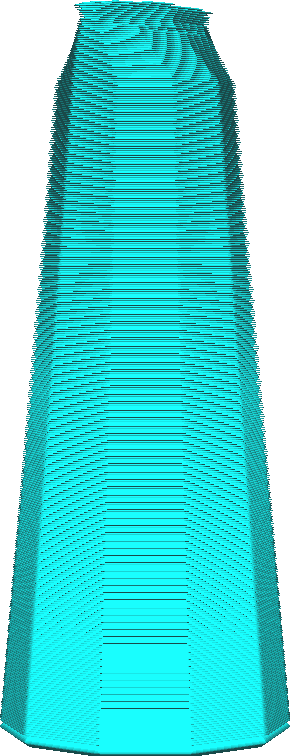

Diamètre des branches de support arborescent
====
Ce paramètre vous permet d'ajuster la largeur des branches du support de l'arbre. La largeur spécifiée ici sera la largeur au sommet des branches de l'arbre. L'extrémité de la branche sera plus fine et, vers le bas, elle s'élargira progressivement selon le paramètre [Angle de diamètre des branches de support arborescent](support_tree_branch_diameter_angle.md).

Les branches plus larges sont plus stables, ce qui réduit le risque que l'arbre soit renversé par la buse s'il doit le traverser.

Les branches plus larges se rejoignent également plus rapidement. Cela permet d'économiser du matériel, mais peut aussi empêcher qu'une partie du modèle soit correctement supportée, et même une partie du support lui-même. Lorsque les branches sont fusionnées ensemble, elles n'ont plus de contour. Il est préférable de combiner les branches larges avec un [espacement](support_tree_branch_distance.md) ou un [remplissage](../support/support_infill_rate.md) afin de soutenir correctement les parties situées au milieu des branches larges.

Les branches plus larges auront également plus de mal à naviguer dans votre modèle. Cela peut faire en sorte qu'une plus grande partie du support repose sur le modèle plutôt que sur la plaque de construction. Par conséquent, votre modèle peut présenter davantage de cicatrices après le retrait des structures de soutien.
