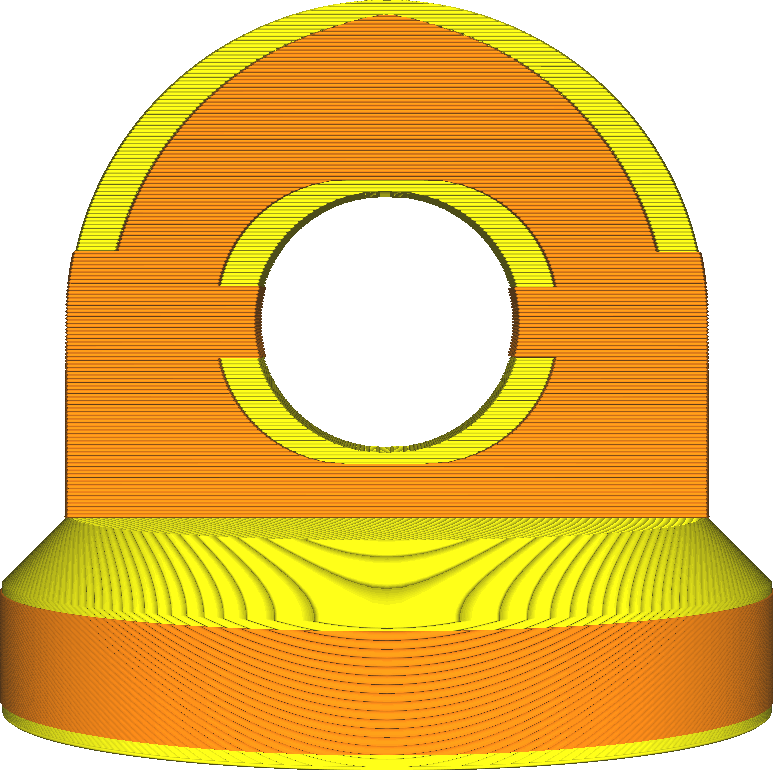

Largeur minimum de la couche extérieure pour l'expansion
===

Comme la peau est présente dans tout le modèle, il est inutile d'étendre toutes ces zones. Au contraire, seuls les angles de la peau qui sont déjà plus larges que ce paramètre seront élargis. De cette façon, les surfaces planes avec des éléments en saillie seront renforcées, sans augmenter inutilement le temps d'impression pour le reste du modèle.

L'expansion de la peau est utile pour renforcer le lien entre le haut ou le bas de l'impression et les parois latérales. Cependant, elle peut également augmenter considérablement le temps d'impression et l'utilisation du matériau. Ce paramètre vous permet de filtrer le matériau des côtés de l'impression où il est moins utile pour renforcer le lien entre les murs et la peau.

Vous pouvez également configurer ce paramètre avec le paramètre [Angle maximum de la couche extérieure pour l'expansion](max_skin_angle_for_expansion.md). Si ce paramètre est modifié, il le sera automatiquement. Ce paramètre est celui qui est effectivement utilisé pour le découpage.
