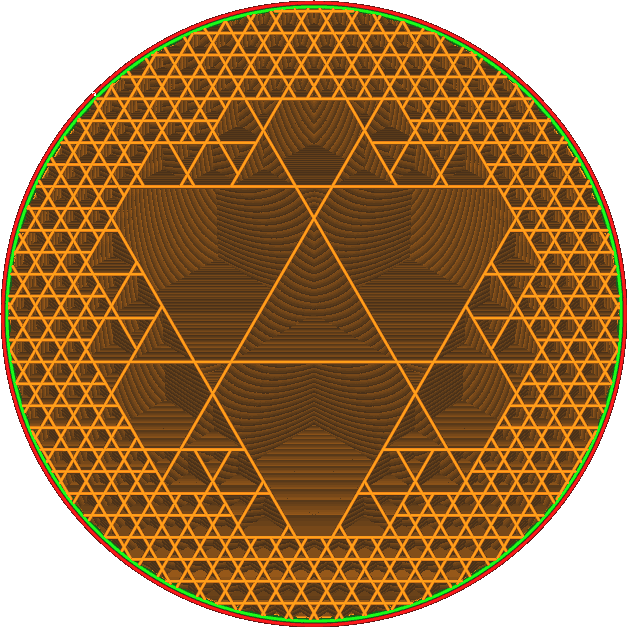

Coque de la subdivision cubique
====
Ce réglage fait que le motif de remplissage de la subdivision cubique commence à réduire un peu plus le remplissage vers l'intérieur, pour améliorer la résistance de l'impression.

La Subdivision Cubique fonctionne en supprimant les frontières entre huit cubes adjacents si aucun des cubes ne touche la frontière du volume de remplissage. Ce réglage déplace cette frontière plus à l'intérieur, empêchant ainsi la suppression des frontières entre les cubes.

En fait, cela permet au modèle de subdivision cubique de dessiner la densité maximale plus souvent. Cela augmente la résistance de l'objet, mais aussi le temps et le matériel nécessaires pour l'imprimer. À l'extrême, en augmentant suffisamment ce paramètre, le schéma de subdivision cubique finira par être le même que le schéma cubique simple.

Vous pouvez également régler ce paramètre sur un nombre négatif. Cela permet d'enlever plus souvent les bordures entre les cubes, réduisant ainsi la quantité de remplissage sur les bords.
