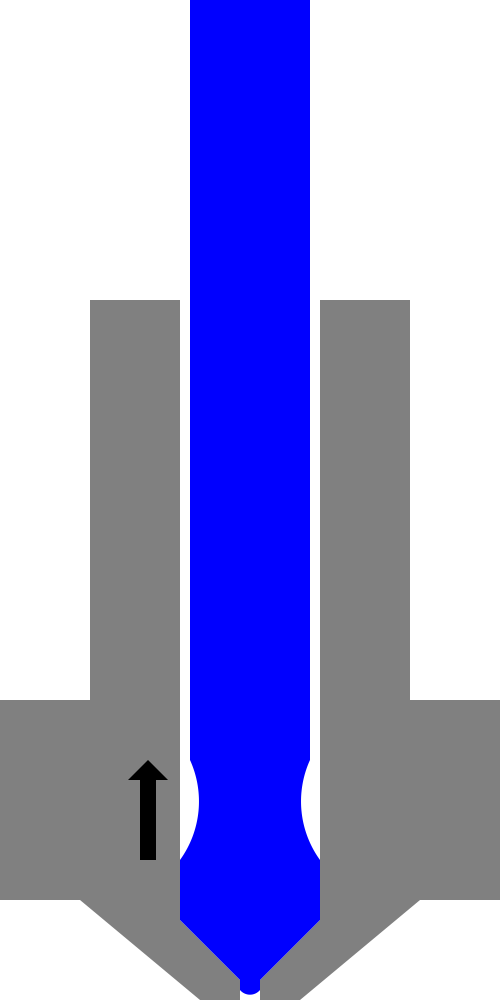

Position anti-suintage rétractée
====
Pour certaines imprimantes, lorsqu'un matériau est rétracté pour un interrupteur à filament, le matériau doit être coupé proprement afin de le faire passer dans le chargeur sans s'emmêler. Ce réglage configure une partie de la procédure pour le rompre proprement.

Ce réglage ajuste la première position dans laquelle le matériau est rétracté afin d'empêcher qu'il ne suinte. Le matériau n'est pas encore cassé à ce stade. Le but est seulement de supprimer rapidement la pression sur la chambre de la buse en la tirant vers l'intérieur.

**Ce paramètre n'est actuellement jamais visible dans l'interface de Cura. Il ne peut être défini que par les profils. Il n'est pas non plus utilisé par Cura pendant le découpage. Cependant, les imprimeurs qui comprennent le format de fichier matériel de Cura peuvent l'utiliser pour configurer correctement leur procédure de changement de filament ** Grâce à un script de post-traitement, la commande "M600" peut être insérée dans l'impression, ce qui déclenchera un changement de filament.**
