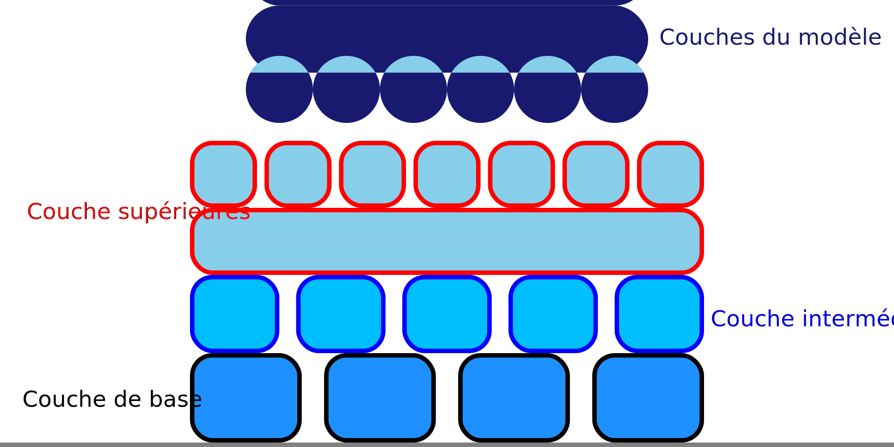

Vitesse d’impression de la base du radeau
====
Ce paramètre configure la vitesse à laquelle la couche de base du radeau est imprimée. La vitesse de la couche de base peut être configurée séparément de la vitesse des couches supérieure et intermédiaire.

L'impression plus lente de la couche de base permet au matériau de s'écouler plus facilement. Cela augmente la surface de contact entre le radeau et la plaque de construction, ce qui lui permet de mieux adhérer à la plaque de construction. En gardant le matériau chaud plus longtemps, le plastique est également recuit, ce qui réduit la contrainte interne. Ces deux effets réduisent le gauchissement. La couche de base est généralement imprimée plus lentement que les autres. Bien entendu, si la vitesse d'impression de la couche de base est trop réduite, l'impression sera plus longue.

Lorsque le radeau est utilisé, la [vitesse d'impression de la couche initiale](speed_print_layer_0.md) s'applique à la couche initiale du modèle, et non à la couche initiale du radeau. Les déplacements à l'intérieur du radeau se feront à la [vitesse de déplacement](../speed/speed_travel.md) ordinaire.
