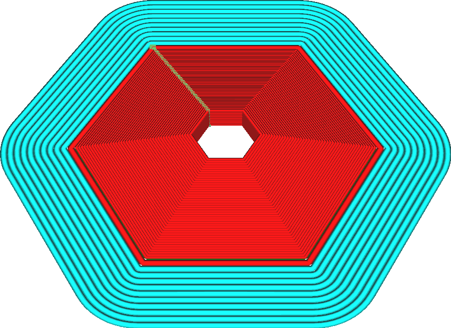

Largeur de ligne couche initiale
====
Cela rend les lignes de la couche initiale plus larges ou plus fines dans un certain rapport.

L'objectif de ce réglage est d'améliorer l'adhérence à la plaque de construction. Afin d'imprimer des lignes plus larges, la buse doit extruder plus de matière et cette matière doit s'écouler plus largement vers l'extérieur. La buse doit donc presser le matériau plus fort sur la plaque de montage, ce qui augmente l'adhérence entre le filament et la plaque de montage.
* Non seulement les lignes seront plus larges ou plus fines, mais elles seront également plus éloignées ou plus proches les unes des autres par le même facteur, ce qui ne produira pas de sur ou de sous-extrusion.
* Ce réglage affecte toutes les largeurs de lignes ; la peau, les parois, l'adhérence, le support, la tour d'amorçage, etc. Elles seront rendues plus larges ou plus fines par le même rapport.
