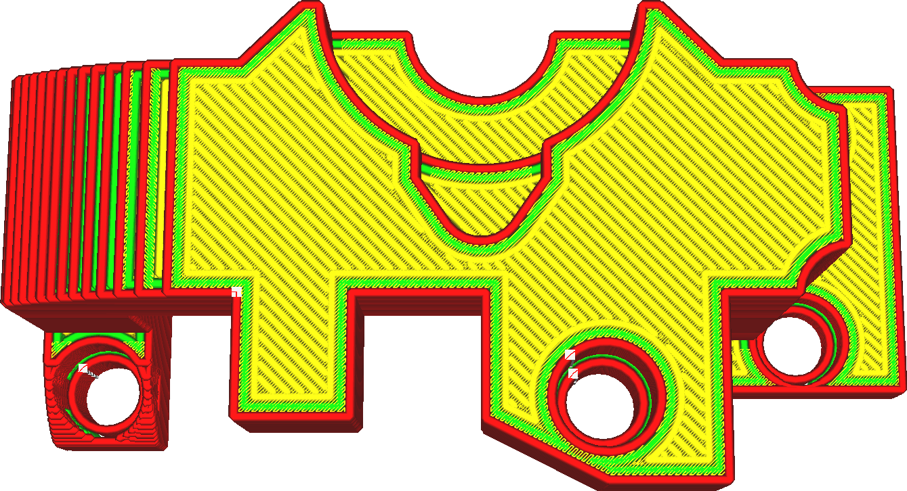

Activer l'étirage
====
Le repassage oblige l'imprimante à effectuer un nouveau passage sur la surface supérieure afin de la rendre encore plus lisse. Ce passage supplémentaire a une très faible largeur de ligne et imprime très lentement.

Le repassage permet d'imprimer un motif linéaire sur la surface supérieure de votre empreinte. Cela a deux effets bénéfiques majeurs :
* Il fait fondre la surface supérieure en la passant plusieurs fois sur une buse chaude. C'est de là que vient le nom "repassage". La vitesse de déplacement étant très faible et la largeur du trait étant très petite, la buse chauffe la surface de manière significative. La partie plate de la buse la caresse alors de manière lisse.
* Elle comble les lacunes de la surface supérieure. Le mouvement de repassage se fait à la même hauteur que la couche elle-même. Il a moins de débit qu'une couche pleine, mais il a quand même un certain débit. En théorie, ce flux n'a nulle part où aller, mais en pratique, il maintient la pression à l'intérieur de la chambre de la buse. Chaque fois que la buse passe sur une irrégularité de la surface, le matériau dans la buse s'écoule dans cet espace.

Cependant, l'étirage présente également quelques inconvénients :
* Il augmente considérablement le temps d'impression.
* Si le motif de l'étirage présente des interruptions (parce qu'il doit se déplacer vers différentes parties), il laissera une ligne visible entre la partie qui a été repassée plus tôt et la partie qui a été repassée plus tard. Cela peut parfois être évité en réglant le [Motif d'étirage](ironing_pattern.md) sur un motif différent, par exemple Concentré.
* Les surfaces inclinées, ou les surfaces supérieures avec beaucoup de détails, peuvent également être repassées, ce qui augmente l'effet de topographie. Les frontières entre les couches deviennent plus prononcées. Cela peut être évité en activant [N'étirer que la couche supérieure](ironing_only_highest_layer.md).

