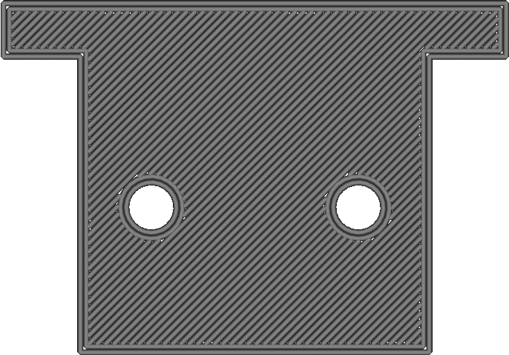
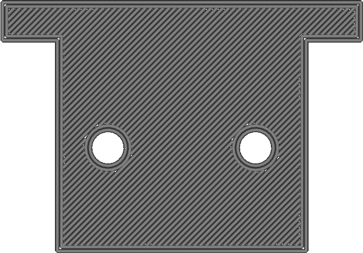

Extérieur avant les parois intérieures
====
Ce paramètre détermine quels murs sont imprimés en premier, les murs extérieurs ou les murs intérieurs.

L'activation de ce paramètre a un faible effet sur la qualité ainsi que sur la précision dimensionnelle :
* Il améliorera la précision dimensionnelle. Les parois adjacentes se repoussent généralement un peu, surtout si la largeur de la ligne de paroi est inférieure à la taille de la buse. La paroi qui est imprimée en premier aura été solidifiée et ne sera pas poussée autant. Par conséquent, en imprimant d'abord la paroi extérieure, vous obtiendrez un emplacement plus précis de votre paroi extérieure.
* Si le remplissage est imprimé avant les parois, cela réduira la quantité de remplissage qui transparaît à la surface. Sinon, le remplissage est imprimé en premier, puis les parois intérieures qui sont poussées vers l'extérieur par le remplissage, et enfin la paroi extérieure qui est poussée vers l'extérieur par les parois intérieures. Un motif pourrait donc être visible à l'extérieur. Si la paroi extérieure est imprimée en premier, la paroi extérieure peut se solidifier avant que la paroi intérieure ne puisse la pousser.
* L'impression de la paroi extérieure en premier est généralement pire pour le surplomb. La paroi extérieure est plus éloignée de la couche précédente que la paroi intérieure. Lorsque la paroi extérieure est imprimée en premier, elle n'a pas encore de prise sur la paroi intérieure. Lorsque la paroi intérieure est imprimée en premier, la paroi extérieure peut s'attacher latéralement à la paroi extérieure.
