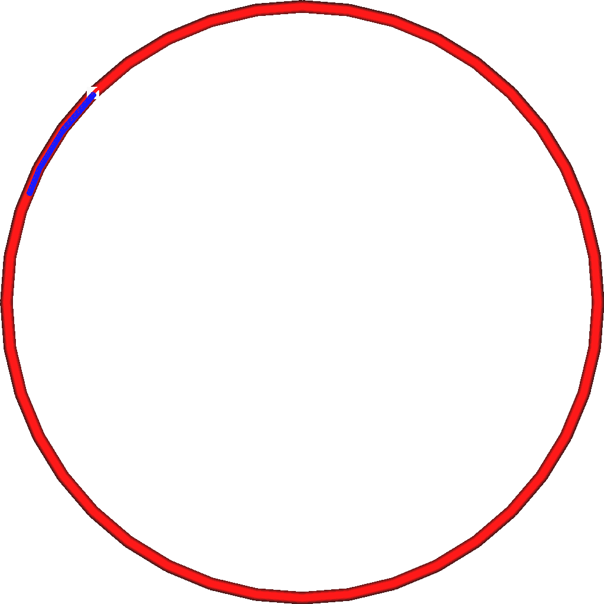

Distance d'essuyage paroi extérieure
====
Avec ce réglage, à l'extrémité de chaque paroi extérieure, la buse se déplacera légèrement plus loin sans extrusion, essuyant le contour fermé.

Le but de cette caractéristique est de réduire la visibilité de la couture. Lorsque la paroi est terminée, le bourrelet se trouve normalement encore légèrement derrière la buse. Ce petit mouvement de translation relie le bourrelet au début du contour, de sorte que la couture est fermée.

La couture sera toujours visible, mais le résultat devrait être légèrement meilleur avec une petite distance d'essuyage. Une augmentation trop importante de ce réglage n'a plus d'effet puisque la buse se déplace au-delà du joint, et peut provoquer une certaine sous-extrusion plus tard, lorsque la chambre de la buse se vide en suintant sur la paroi extérieure.

Cet effet est essentiellement l'opposé de [la roue libre](../experimental/coasting_enable.md), qui s'arrêtera d'extruder légèrement avant que le contour ne soit terminé.
