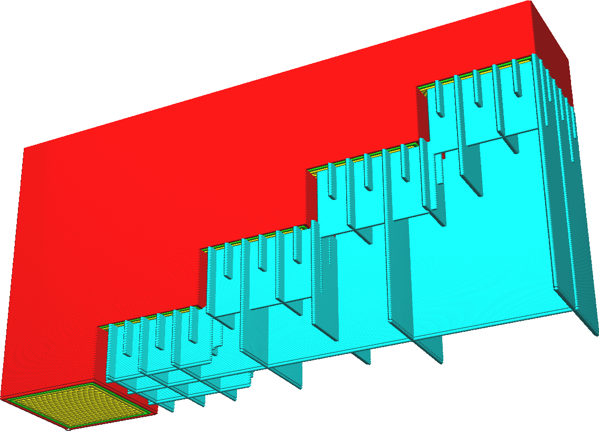

Hauteur d'étape de remplissage graduel du support
====
Lorsque vous utilisez un support graduel, la densité du support est périodiquement réduite de haut en bas en plusieurs étapes. À chaque étape, la densité du support est divisée par deux. Ce paramètre indique la hauteur de ces marches, la distance entre deux endroits où la densité du support est divisée par deux.

Le soutien progressif, de par sa nature, suspendra une partie du soutien en l'air. Cependant, cela se répare normalement automatiquement. La première couche de support sera suspendue dans les airs et se fixera uniquement sur les côtés du support correctement. Les couches au-dessus peuvent reposer sur la couche précédente un peu aux extrémités, mais s'affaisseront au milieu. Cela s'améliore progressivement, couche par couche. Si la hauteur de l'étape de support progressif est suffisamment grande, le support est correctement robuste au moment où l'étape de densité suivante se produit.

Réduisez la hauteur du gradin de support graduel afin de descendre rapidement à une faible densité de support. Cela permet d'économiser sur le temps d'impression et l'utilisation du matériel. Augmentez la hauteur de l'étape de remplissage graduel du support si le support ne dispose pas de suffisamment d'espace pour se réparer au moment où la prochaine étape de densité du support se produit. L'augmentation de la valeur de ce paramètre rend l'impression plus fiable.
