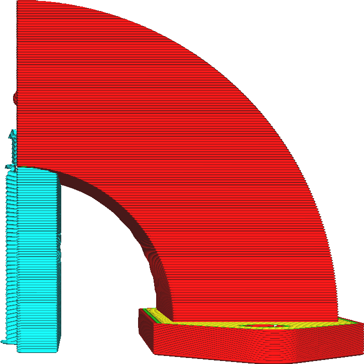

Angle de porte-à-faux de support
====
L'angle de porte_à_faux influence la quantité de matière placée pour soutenir l'impression. L'angle indique l'angle minimum qui est supporté.

**Réduire la valeur de ce paramètre génère plus de support.**

En réduisant ce paramètre, l'imprimante prend en charge une plus grande partie de la partie imprimée, même les surfaces qui sont plus droites et qui ne s'affaissent pas beaucoup pendant l'impression. Si le support supporte des parties qui n'ont pas besoin d'être soutenues, cela augmentera inutilement le temps d'impression et l'utilisation de matériel et créera également des marques là où le support a touché l'impression.

Cependant, il est parfois nécessaire de réduire l'angle du support pour éviter que le matériau ne s'affaisse trop. Cela améliore généralement la précision dimensionnelle de la pièce finale et permet également d'améliorer l'aspect des débords.

Lorsque l'on travaille avec un support, il est bon de prévisualiser l'aspect du support lors de la phase de prévisualisation. Vous pourrez alors voir où il va réellement générer du support. Le réglage de ce paramètre est alors l'un des outils à votre disposition pour filtrer l'endroit précis où il va générer du soutien.
