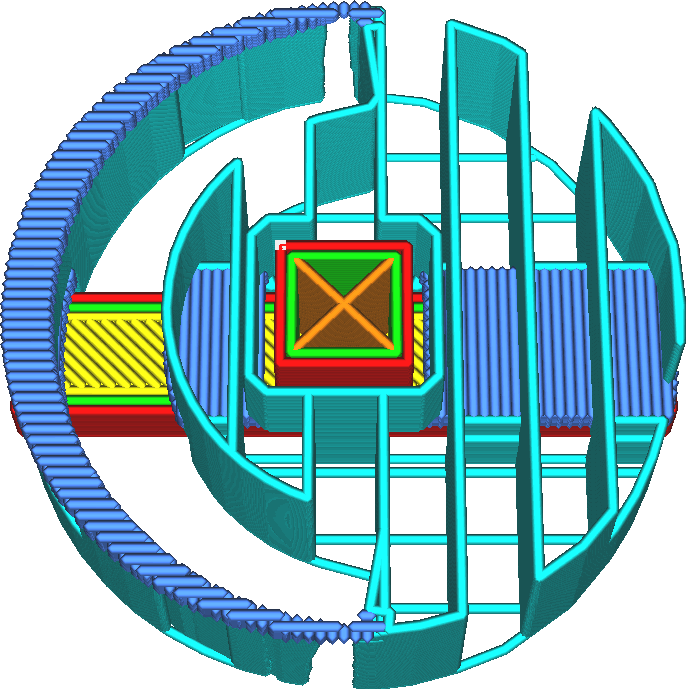
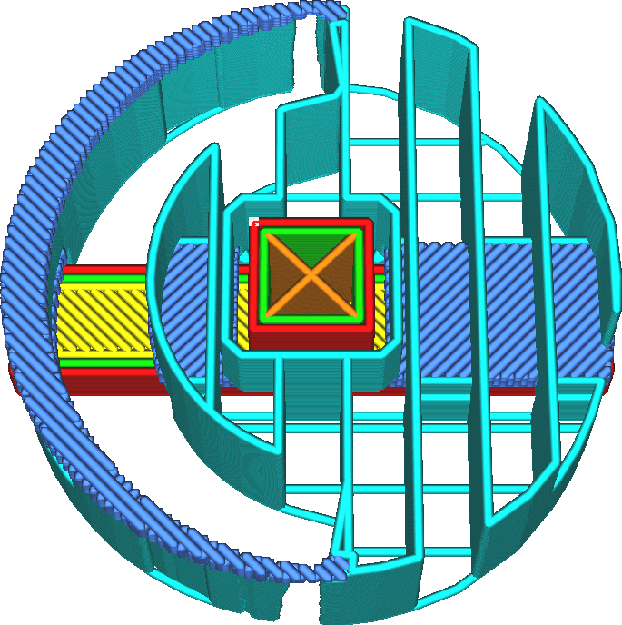

Direction de la ligne de bas de support
====
Le plancher de support est normalement orienté de manière à être aussi perpendiculaire que possible au support situé au-dessus et au modèle situé en dessous. Si l'orientation des lignes de la surface supérieure ou des lignes de support a été personnalisée, il est conseillé de personnaliser également l'orientation des lignes du plancher de support. Ce paramètre vous permet de personnaliser l'orientation des lignes du plancher de soutien.

Plusieurs angles peuvent être remplis pour ce paramètre, séparés par des virgules. Cura fera alterner ces angles entre les couches.

Les lignes du plancher de support seront idéalement orientées pour être perpendiculaires aux lignes du modèle sur lesquelles elles reposent ainsi qu'aux lignes de support qui reposent sur elles. En les orientant perpendiculairement, on réduit la distance que ces lignes doivent franchir, ce qui réduit l'affaissement et améliore la stabilité du support.
