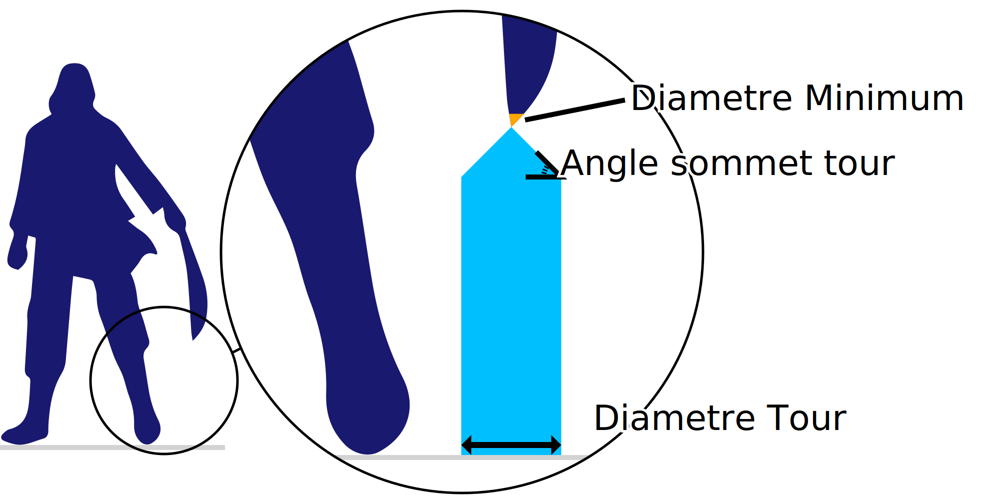

Angle du toit de la tour
====
Les tours de soutien ont un sommet pointu, qui fait la transition entre le pilier le plus large de la tour et l'étroite zone de surplomb qui doit en fait être soutenue.

Une valeur plus élevée fait que les tours de soutien ont un toit très pointu. La tour commence alors à réduire sa largeur un peu plus bas déjà, ce qui réduit la stabilité de la tour mais permet d'économiser du matériel et du temps d'impression.

Une valeur plus faible fait que les tours de support ont un toit plus plat.
