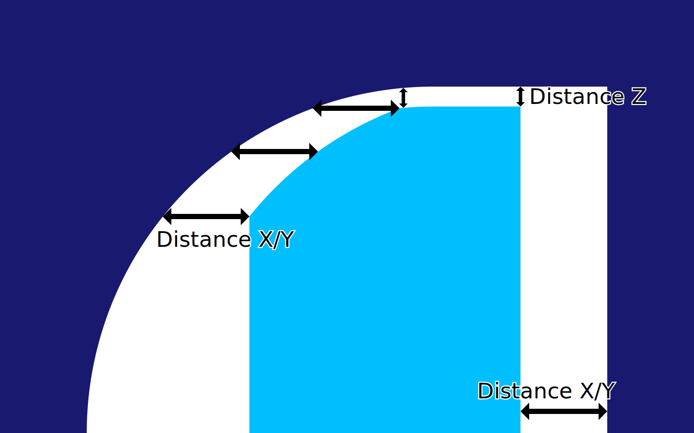

Priorité de distance des supports
===
La [distance X/Y](support_xy_distance.md) et la [distance Z](support_z_distance.md) de support doivent être observées exactement ; ni plus, ni moins. Cette méthode est trop contraignante, il doit donc y avoir une préférence entre les deux. Ce paramètre détermine cette préférence.

X/Y prioritaire sur Z
----

Si la distance X/Y est supérieure à la distance Z, alors la distance X/Y est toujours maintenue constante, même si cela signifie que la distance Z est supérieure à celle souhaitée. La distance Z est toujours maintenue comme une distance minimale, de sorte que si le surplomb est très horizontal, la distance Z s'applique toujours, rendant la distance X/Y plus grande que désirée.

Z prioritaire sur X/Y
----

Si la distance Z est supérieure à la distance X/Y, alors la distance Z est toujours maintenue constante, même si cela signifie que la distance X/Y est plus petite que souhaitée. La distance X/Y n'a alors d'influence sur l'impression qu'aux endroits où la distance Z n'entre pas en jeu, donc pas au sommet des structures de support mais seulement sur les côtés.

Une distance X/Y minimale est cependant toujours respectée. Si le surplomb est très vertical, la distance X/Y deviendrait si petite que le support pourrait fusionner avec les côtés du modèle. La [distance X/Y minimale](support_xy_distance_overhang.md) permet d'éviter cela.
