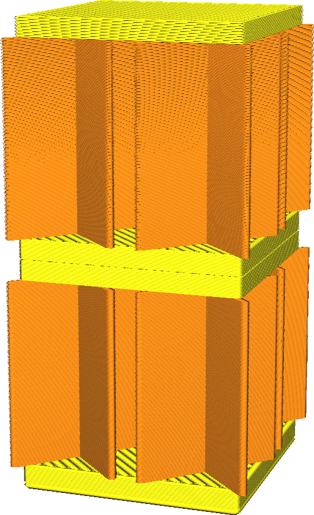
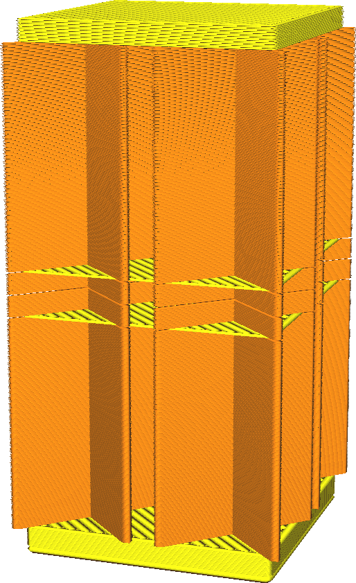

Aucune couche dans les trous en Z
====
Si votre modèle présente une petite fente horizontale, plus petite que l'épaisseur de la peau du haut et du bas, ce réglage ne prend pas la peine de remplir complètement de peau le haut et le bas au-dessus/en dessous. Cela permet de gagner du temps de découpe et d'impression, mais risque d'exposer le remplissage à l'air.

L'objectif principal de ce réglage est de réduire le temps de tranchage. Ce réglage réduit effectivement la résolution avec laquelle Cura prélève les échantillons de peau à l'endroit où ils doivent être placés. Selon la forme du modèle, cela pourrait permettre de gagner entre 5 et 30 % sur le temps de tranchage. Il permet également de gagner du temps d'impression en cas de petits trous, car au lieu de la peau, c'est le remplissage qui est imprimé.

Si le modèle ne présente pas d'interstices horizontaux plus petits que l'épaisseur de la peau, le seul effet sera une réduction du temps de tranchage.

Si le modèle présente de tels espaces horizontaux, le remplissage sera exposé dans l'espace. Cependant, si l'espace est suffisamment petit, le surplomb fera s'affaisser les murs au point de ne plus être visible.
