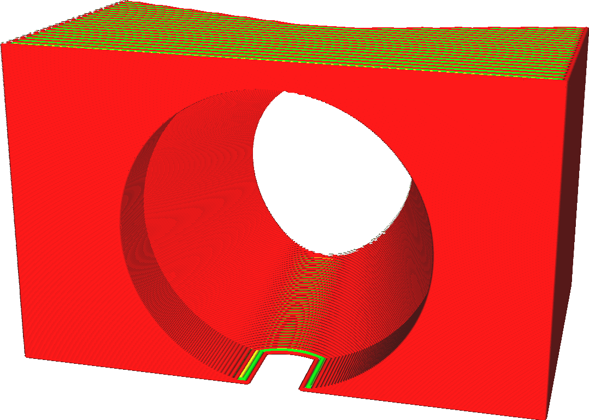
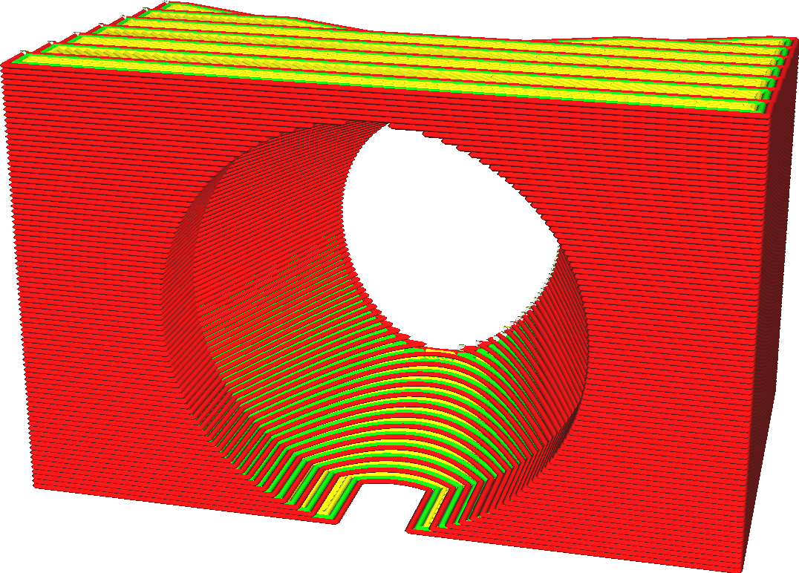

De 3D printer legt plastic neer in laagjes. De laaghoogte bepaalt hoe dik deze lagen zijn, in millimeter. Het is de belangrijkste factor voor zowel de visuele kwaliteit van de uiteindelijke print als de printtijd.

De laaghoogte is de allerbelangrijkste instelling om de afweging te bepalen tussen de algemene kwaliteit en de printtijd. Het heeft verregaande effecten op de print. Hier zijn enkele effecten:
* Dunnere laagjes geven een betere visuele kwaliteit voor de print. Omdat de laagjes dunner zijn wordt het topografieeffect minder zichtbaar. Tevens zijn de laagjes dichter bij elkaar, waardoor het oppervlakte gladder wordt.
* Met dunnere laagjes kan de printer meer details aanbrengen aan de boven- en onderkant van de print.
* Dikkere lagen zorgt dat de print sterker wordt, tot op zekere hoogte. Er zijn minder grensvlakken tussen de lagen, en dat is vaak een zwaktepunt van de print. Dikkere laagjes schuiven niet zo veel.
* Hoe dikker de lagen, hoe minder lagen geprint hoeven te worden en hoe korter de print tijd. De nozzle hoeft minder horizontaal te bewegen.

Laaghoogte vs. profielen
----
Veel instellingen zijn afhankelijk van de laaghoogte. Omdat de laaghoogte veel invloed heeft op hoe snel het materiaal uit de nozzle moet stromen, verandert er veel aan het printproces. Dit is erg ingewikkeld. Als bijvoorbeeld de laaghoogte wordt verhoogd, moet ook de printtemperatuur worden verhoogd om te compenseren voor het extra verlies van warmte aan de grotere hoeveelheid materiaal. Deze temperatuur beïnvloedt vervolgens de vloeibaarheid van het materiaal en daarmee hoe scherp de hoekjes worden, hoe veel koeling er nodig is, enzovoorts. Het is altijd verstandig om te beginnen vanuit een voorgemaakt profiel als er profielen zijn voor jouw printer en set-up. Begin vanuit het profiel met de laaghoogte die het dichtst ligt bij wat je nodig hebt.

Je kan de gewenste laaghoogte kiezen in de Aangepaste modus, maar voorgemaakte profielen zijn ook beschikbaar met diverse laaghoogtes. Je kan kiezen uit profielen met diverse laaghoogtes in Aanbevolen modus met de schuifbalkjes, of met een drop-down in Aangepaste modus. Omdat deze profielen ook andere instellingen aanpassen dan enkel de laaghoogte, krijg je waarschijnlijk een betere kwaliteit op deze manier.

Overige tips
----
Op zeer kleine laaghoogtes kom je misschien tegen het resolutielimiet aan van de Z-as van de printer. Zoek op wat de stapgrootte is van de printer's Z as en zorg dat de laaghoogte een meervoud daarvan is. Als het niet goed past, zullen sommige laagjes iets dikker worden en sommige laagjes iets dunner. Dit geeft een bandeneffect.

*De laaghoogte bepaalt niet de dikte van de eerste laag of de raftlagen. Deze hebben hun eigen instellingen om de laagdikte apart in te stellen. Als adaptieve lagen gebruikt worden, is deze laaghoogteinstelling een gemiddelde dikte, maar in werkelijkheid is er wat variatie in de dikte van de lagen.*