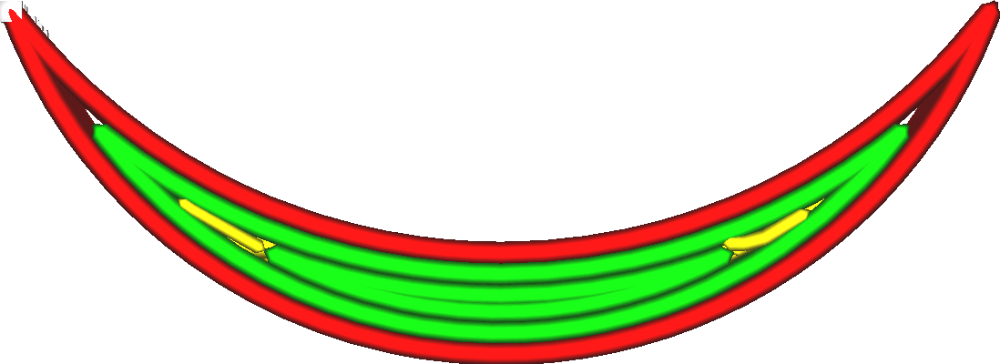
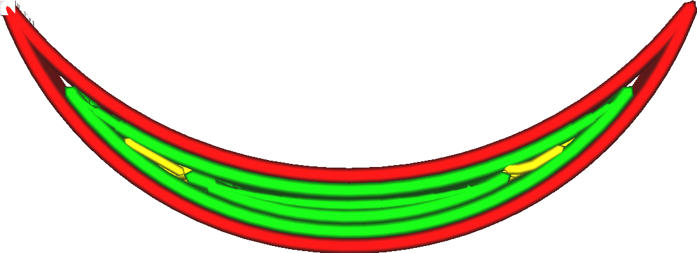

Компенсация перекрытия внутренних стен
====
При печати тонких деталей, противоположенные стены могут перекрывать друг друга из-за слишком близкого расстояния друг к другу. Если печать стен будет идти с нормальной шириной линий, то получится переэкструзия. Включенный параметр предотвращает избыточное выдавливания материала, уменьшая ширину одной из линий, при этом улучшается точность размера деталей.

Этот параметр применяется только ко внутренним стенам. Компенсация перекрытия внутренних стенок не так заметна как на внешних, поэтому будет видно меньше артефактов и изменение скорости потока. Однако это не способствует уменьшению проблемы с избыточной экструзией, и в этом случае стены будут по прежнему мешать друг друга

Ширина линии стены, перекрывающая соседнюю уменьшается на площадь перекрытия, таким образом это компенсирует переэкструзию.

Как описано выше, этот параметр имеет тенденцию улучшать точность деталей, но не без недостатков. Одним из таких является изменение скорости потока материала, что в следствии приводит к неравномерной экструзии в целом. В некоторых частях може быть недоэкструзия, а в некоторых может быдь даже избыток материала. Кроме этого скорость потока может быть снижена настолько, что может привезти к полной останоке подачи материала даже там где он должна быть. чтобы уменьшить эффект недоэкструзии, воспользуйтесь параметром  [Minimum Wall Flow] (wall_min_flow.md) для ограничения минимальной скорости за счет точности изготовления детали.

**Включенный параметр может сделать модель не слишком эстетичным. Визуально программа не показывает компенсацию перекрытия стен, а вид стоя основан на сгенерированом G-code. В реальности слои ведут себя иначе и способны вытеснять друг друга из своих мест, особенно в тех, где идет их перекрытие. Более того, перепады потока материала очень сильно сказываются на качестве печати, поскольку экструдер хоть и способен изменить свою скорость быстро, материал этого сделать не позволит из-за его упругости. Все эти оссобенности делаю результат печати более непредсказуемой, чем его визуализация в программе** 